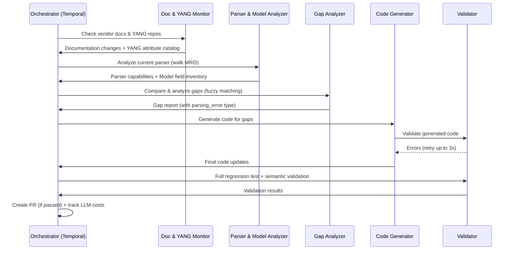

# Self-Sustaining Parser Validation & Update System - Design Proposal

**Version:** 2.0
**Date:** February 21, 2026
**Status:** Design Proposal
**Author:** ConfigZ Project Team

---

## Executive Summary

A multi-agent AI system that continuously monitors vendor documentation and YANG models, validates text-based configuration parsers against current syntax, identifies gaps, and autonomously updates Pydantic data models and parsers to maintain support for latest OS versions.

### Key Capabilities

- **Continuous Monitoring** - Automatically detect vendor documentation changes and new OS releases
- **YANG-Augmented Analysis** - Use vendor-native YANG models to discover protocol attributes and types
- **Gap Analysis** - Identify missing features, unsupported syntax, and parsing errors
- **Automated Code Generation** - Generate parser and data model updates with iterative refinement
- **Validation & Testing** - Multi-layer quality gates including semantic validation against vendor examples
- **Human-in-the-Loop** - Strategic oversight with autonomous execution
- **Continuous Learning** - Feedback loops that improve generation quality over time

### Expected Impact

- **70%+ reduction** in manual parser maintenance effort
- **<7 days** time-to-support for new OS versions
- **95%+ coverage** of vendor documentation
- **90%+ success rate** on automated code generation (via iterative refinement)

---

## Table of Contents

1. [System Architecture](#system-architecture)
2. [Detailed Component Design](#detailed-component-design)
3. [Data Models](#data-models-for-the-system)
4. [Implementation Phases](#implementation-phases)
5. [Operating Modes](#operating-modes)
6. [Key Technologies](#key-technologies--tools)
7. [Success Metrics](#success-metrics)
8. [Observability & Debugging](#observability--debugging)
9. [Security Considerations](#security-considerations)
10. [Risk Mitigation](#risk-mitigation)
11. [Future Enhancements](#future-enhancements)

---

## System Architecture

### High-Level Components

```
+-------------------------------------------------------------------+
|                    Orchestrator Agent                              |
|          (Temporal Workflows + Event Coordination)                |
+--------------------+----------------------------------------------+
                     |
     +---------------+--------------------------------------------+
     |                   Event Bus (Redis Streams)                |
     +--+------+----------+------------------+--------------+-----+
        |      |          |                  |              |
        v      v          v                  v              v
+--------+ +----------+ +---------+  +-----------+  +--------------+
| Doc &  | | Parser & | | Gap     |  | Code      |  | Validation   |
| YANG   | | Model    | | Analysis|  | Generator |  | & Testing    |
| Monitor| | Analyzer | | Agent   |  | Agent     |  | Agent        |
+--------+ +----------+ +---------+  +-----------+  +--------------+
     |          |           |              |                |
     v          v           v              v                v
+-------------------------------------------------------------------+
|                   Data Storage Layer                               |
|  PostgreSQL: Documentation, Gaps, Feedback, LLM Usage Tracking    |
|  Redis: Caching, Event Bus                                        |
|  Git: Code Changes, Parser History                                |
|  Vector DB: Code Embeddings for RAG                               |
+-------------------------------------------------------------------+
```

### Design Principles (New in v2)

1. **Event-Driven Architecture** - Agents communicate through an event bus (Redis Streams), not exclusively through the Orchestrator. The Orchestrator coordinates workflows; it is not a mandatory pass-through for all data.
2. **Durable Workflows** - Every multi-step pipeline runs as a Temporal workflow with checkpoints. If step 4 fails, steps 1-3 are preserved and the workflow resumes from the last checkpoint.
3. **Text-Config First** - Users provide text-based device configurations. The system parses CLI-style config text. YANG models are used as a supplementary source to discover what attributes and types a protocol supports - not as an input format.
4. **Iterative Refinement** - Code generation uses a generate-validate-fix loop (up to 3 attempts) before escalating to humans, pushing success rates from ~80% to ~90%+.
5. **Observability by Default** - Structured logging, OpenTelemetry tracing, and full execution audit trails from day one.

### Component Interactions



---

## Detailed Component Design

### 1. Documentation & YANG Monitor Agent

**Purpose:** Continuously monitor vendor documentation for syntax changes and use vendor-native YANG models to build comprehensive attribute catalogs for each protocol.

> **Clarification on YANG Usage:** Users of ConfigZ provide **text-based CLI configurations** (e.g., `show running-config` output). The parsers process CLI text. YANG models are used by this agent as a **machine-readable supplementary source** to discover what attributes, types, and constraints a protocol/service supports on a given vendor platform. This eliminates the need to reverse-engineer attribute lists solely from HTML documentation. We use **vendor-native YANG models only** (Cisco, Arista) - not OpenConfig models.

#### Data Source Priority

| Priority | Source | Reliability | Purpose |
|----------|--------|-------------|---------|
| 1 | **Vendor YANG models** | High | Attribute discovery, type inference, version tracking |
| 2 | **Vendor APIs** (DevNet, CVP) | High | Release notes, change summaries |
| 3 | **Vendor documentation** (HTML/PDF) | Medium | Configuration examples, context, deprecation notes |
| 4 | **RSS/Atom feeds** | Medium | Release notifications |
| 5 | **Web scraping** (fallback) | Low | When APIs unavailable |

#### YANG Model Integration

**Why YANG Models?**
- Cisco and Arista publish native YANG models on GitHub (`github.com/YangModels/yang` for Cisco, `github.com/aristanetworks/yang` for Arista).
- YANG models are machine-readable schemas that define every configurable attribute, its type, constraints, and the OS version it was introduced.
- Parsing a YANG model gives us a structured attribute catalog without fragile HTML scraping.
- Example: The Cisco IOS-XE YANG model `Cisco-IOS-XE-bgp.yang` defines every BGP attribute with exact types.

**What We Extract from YANG:**
- Leaf names -> attribute names for our Pydantic models
- Leaf types (uint32, string, inet:ipv4-address, boolean, enumeration) -> Python type hints
- Container/list hierarchy -> data model nesting structure
- `when` / `if-feature` clauses -> version/feature dependencies
- `description` statements -> documentation for generated code
- `deprecated` / `obsolete` status -> deprecation tracking

**What We Do NOT Do:**
- We do not require users to provide YANG/NETCONF data
- We do not use OpenConfig YANG models
- We do not generate NETCONF/RESTCONF parsers - our parsers handle CLI text

#### Implementation

```python
import re
from pathlib import Path
from datetime import datetime

class DocumentationYANGMonitorAgent:
    """
    Monitors vendor documentation and YANG models for changes.
    Uses YANG models as primary source for attribute discovery.
    Uses documentation for examples, context, and deprecation notes.
    """

    def __init__(self, storage, config):
        self.storage = storage
        self.config = config

        # YANG model sources (vendor-native only, no OpenConfig)
        self.yang_sources = {
            'cisco_iosxe': YANGGitSource(
                repo_url='https://github.com/YangModels/yang',
                path_prefix='vendor/cisco/xe',
                vendor='cisco', os_type='iosxe'
            ),
            'cisco_iosxr': YANGGitSource(
                repo_url='https://github.com/YangModels/yang',
                path_prefix='vendor/cisco/xr',
                vendor='cisco', os_type='iosxr'
            ),
            'cisco_nxos': YANGGitSource(
                repo_url='https://github.com/YangModels/yang',
                path_prefix='vendor/cisco/nx',
                vendor='cisco', os_type='nxos'
            ),
            'arista_eos': YANGGitSource(
                repo_url='https://github.com/aristanetworks/yang',
                path_prefix='EOS',
                vendor='arista', os_type='eos'
            ),
        }

        # Documentation scrapers (supplementary)
        self.doc_scrapers = {
            'cisco_ios': CiscoDocScraper(os_type='ios'),
            'cisco_iosxe': CiscoDocScraper(os_type='iosxe'),
            'arista_eos': AristaDocScraper(os_type='eos'),
        }

        # YANG parser
        self.yang_parser = YANGAttributeExtractor()

        # Vendor-specific version parsers (not naive string comparison)
        self.version_parsers = {
            'cisco_iosxe': CiscoIOSXEVersionParser(),   # Handles 17.09.04a
            'cisco_iosxr': CiscoIOSXRVersionParser(),   # Handles 7.11.1
            'cisco_nxos': CiscoNXOSVersionParser(),     # Handles 10.4(3)
            'arista_eos': AristaEOSVersionParser(),     # Handles 4.32.2.1F
            'cisco_ios': CiscoIOSVersionParser(),       # Handles 15.9(3)M7
        }

    async def monitor_vendor(
        self, vendor: str, os_type: str, force_update: bool = False
    ) -> DocumentationUpdate | None:
        """Check for documentation and YANG model updates."""
        key = f"{vendor}_{os_type}"
        version_parser = self.version_parsers.get(key)
        last_version = await self.storage.get_last_documented_version(vendor, os_type)

        # Check YANG repo + docs for updates
        yang_source = self.yang_sources.get(key)
        doc_scraper = self.doc_scrapers.get(key)

        yang_update = await self._check_yang_updates(yang_source, last_version, version_parser) if yang_source else None
        doc_update = await self._check_doc_updates(doc_scraper, last_version, version_parser) if doc_scraper else None

        latest_version = self._determine_latest_version(last_version, yang_update, doc_update, version_parser)

        if not force_update and not version_parser.is_newer(latest_version, last_version):
            return None

        changes = []

        # YANG attributes (primary)
        if yang_update:
            changes.extend(await self._extract_yang_attributes(yang_source, latest_version))

        # Documentation examples (supplementary)
        if doc_update:
            doc_context = await self._extract_doc_context(doc_scraper, latest_version)
            changes = self._merge_doc_context(changes, doc_context)

        # Semantic content hash to prevent false positives from format-only changes
        content_hash = self._compute_semantic_hash(changes)
        previous_hash = await self.storage.get_content_hash(vendor, os_type)
        if not force_update and content_hash == previous_hash:
            return None

        await self.storage.save_documentation_update(vendor, os_type, latest_version, changes, content_hash)

        return DocumentationUpdate(
            vendor=vendor, os_type=os_type, version=latest_version,
            release_date=datetime.now(),
            documentation_url=doc_update.url if doc_update else "",
            changes=changes
        )

    async def build_attribute_catalog(
        self, vendor: str, os_type: str, protocol: str | None, version: str | None = None
    ) -> AttributeCatalog:
        """
        Build comprehensive attribute catalog from YANG models.
        Primary mechanism for discovering what attributes a protocol supports.
        """
        key = f"{vendor}_{os_type}"
        yang_source = self.yang_sources.get(key)

        if not yang_source:
            return await self._build_catalog_from_docs(vendor, os_type, protocol, version)

        yang_modules = await self._find_yang_modules(yang_source, protocol, version)
        attributes = {}

        for module_path in yang_modules:
            module_content = await yang_source.read_module(module_path)
            parsed = self.yang_parser.parse_module(module_content)

            for leaf in parsed.leaves:
                attributes[leaf.name] = AttributeInfo(
                    name=leaf.name,
                    yang_path=leaf.full_path,
                    yang_type=leaf.yang_type,
                    python_type=self._yang_type_to_python(leaf.yang_type),
                    description=leaf.description,
                    version_introduced=leaf.when_version or version,
                    is_deprecated=leaf.status in ('deprecated', 'obsolete'),
                    is_mandatory=leaf.mandatory,
                    default_value=leaf.default,
                    cli_keyword=self._infer_cli_keyword(leaf),
                )

        return AttributeCatalog(
            vendor=vendor, os_type=os_type, protocol=protocol,
            version=version, attributes=attributes, source='yang',
        )

    def _yang_type_to_python(self, yang_type: str) -> str:
        """Map YANG types to Python type hints."""
        type_map = {
            'string': 'str', 'boolean': 'bool',
            'uint8': 'int', 'uint16': 'int', 'uint32': 'int', 'uint64': 'int',
            'int8': 'int', 'int16': 'int', 'int32': 'int', 'int64': 'int',
            'decimal64': 'float',
            'inet:ipv4-address': 'IPv4Address', 'inet:ipv6-address': 'IPv6Address',
            'inet:ip-address': 'IPv4Address | IPv6Address',
            'inet:ipv4-prefix': 'IPv4Network', 'inet:ipv6-prefix': 'IPv6Network',
            'inet:as-number': 'int',
            'enumeration': 'str', 'empty': 'bool', 'union': 'str',
        }
        return type_map.get(yang_type, 'str')

    def _compute_semantic_hash(self, changes):
        """Hash semantic content to ignore format-only doc changes."""
        import hashlib
        parts = []
        for c in sorted(changes, key=lambda x: (x.protocol, x.attribute or "")):
            parts.append(f"{c.protocol}:{c.change_type}:{c.attribute}:{c.new_syntax}")
        return hashlib.sha256("|".join(parts).encode()).hexdigest()
```

#### YANG-to-CLI Keyword Mapping (`_infer_cli_keyword`)

This is one of the hardest parts of the system. YANG leaf names are schema identifiers, not CLI keywords. For example, the YANG leaf `soft-reconfiguration` may map to the CLI keyword sequence `soft-reconfiguration inbound`. A three-tier approach handles this:

| Tier | Coverage | Method | Example |
|------|----------|--------|---------|
| **1. Direct mapping** | ~60-70% | `leaf.name.replace('_', '-')` | `remote-as` → `remote-as` |
| **2. Vendor lookup table** | ~20-25% | Hand-curated static mapping file per vendor/OS, version-aware | YANG `soft-reconfiguration` → CLI `soft-reconfiguration inbound` |
| **3. LLM-assisted discovery** | ~5-10% | LLM proposes mapping from YANG description + docs context; human approves | New/unknown mappings go to pending review queue |

**Key design decisions:**
- Tier 2 lookup tables are seeded during Phase 0/1 and grow organically as gaps are found.
- Tier 3 suggestions are **never used automatically** — they enter a "pending review" queue until a human confirms.
- If `cli_keyword` is wrong or missing, the system still works — the Gap Analyzer falls back to fuzzy matching the YANG leaf name against parser attribute names. `cli_keyword` is an optimization for better matching, not a hard dependency.
- LLM cost for Tier 3 is minimal — it only fires for genuinely unmapped attributes, not every YANG leaf.

---

### 2. Parser & Model Analyzer Agent

**Purpose:** Analyze current parser implementations AND Pydantic data models. Walks the class inheritance hierarchy (MRO) to capture inherited methods.

#### Key Improvements Over v1

1. **MRO-Aware Analysis** - Walks Python Method Resolution Order to detect inherited parser methods (e.g., `EOSParser` inheriting `parse_ospf()` from `IOSParser`).
2. **Bidirectional Analysis** - Analyzes parser-to-model (what parser populates) and model-to-parser (what model expects). Detects "dead fields" (defined but never populated) and "shadow attributes" (populated but not in model).
3. **Library-Agnostic Pattern Detection** - Detects patterns from any parsing library (ciscoconfparse2, TTP, textfsm, custom regex), not just `re.search()`/`re.match()`.

#### Implementation

```python
import ast
import re
import inspect
from pathlib import Path
from importlib import import_module

class ParserModelAnalyzerAgent:
    """Analyzes parser implementations AND Pydantic models. Walks MRO."""

    def __init__(self, storage, project_root: Path, llm_client=None):
        self.storage = storage
        self.project_root = project_root
        self.parsers_dir = project_root / "configz" / "parsers"
        self.models_dir = project_root / "configz" / "models"
        self.llm_client = llm_client

    async def analyze_parser(self, parser_class: str) -> ParserCapabilities:
        """
        Analyze parser including inherited methods via MRO.
        For each method: which class defines it, regex patterns, attributes populated.
        """
        parser_cls = self._import_parser_class(parser_class)
        mro = inspect.getmro(parser_cls)

        # Get source files for all classes in MRO
        class_sources = {}
        for cls in mro:
            if cls.__module__.startswith('configz.parsers'):
                source_file = inspect.getfile(cls)
                with open(source_file, 'r') as f:
                    class_sources[cls.__name__] = {'source': f.read(), 'file': source_file}

        # Extract parsing methods across MRO (base first, derived last overrides)
        all_methods = {}
        for cls in reversed(mro):
            cls_name = cls.__name__
            if cls_name not in class_sources:
                continue
            source = class_sources[cls_name]['source']
            tree = ast.parse(source)
            class_node = self._find_class_node(tree, cls_name)
            if class_node:
                for node in class_node.body:
                    if isinstance(node, ast.FunctionDef):
                        if node.name.startswith('parse_') or node.name.startswith('_parse_'):
                            all_methods[node.name] = {
                                'defining_class': cls_name,
                                'method_node': node,
                                'source_code': source,
                                'is_inherited': cls_name != parser_class,
                            }

        # Analyze each method
        protocols = {}
        for method_name, info in all_methods.items():
            protocol = self._method_name_to_protocol(method_name)
            capability = await self._analyze_parsing_method(
                method_name, info['method_node'], info['source_code'],
                info['defining_class'], info['is_inherited'],
            )
            protocols[protocol] = capability

        return ParserCapabilities(
            os_type=self._extract_os_type(parser_class),
            parser_class=parser_class, protocols=protocols,
        )

    async def analyze_data_models(self, protocol: str) -> ModelInventory:
        """Analyze Pydantic models to discover expected fields."""
        model_fields = {}
        for model_file in self.models_dir.glob('*.py'):
            with open(model_file, 'r') as f:
                source = f.read()
            tree = ast.parse(source)
            for node in ast.walk(tree):
                if isinstance(node, ast.ClassDef):
                    if self._class_matches_protocol(node.name, protocol):
                        model_fields[node.name] = self._extract_pydantic_fields(node, source)
        return ModelInventory(protocol=protocol, models=model_fields)

    async def cross_reference(self, parser_cap, model_inv, protocol) -> CrossReferenceResult:
        """Detect dead fields (in model, not populated) and shadow attrs (populated, not in model)."""
        if protocol not in parser_cap.protocols:
            return CrossReferenceResult(dead_fields=list(model_inv.all_field_names()))
        parser_attrs = set(parser_cap.protocols[protocol].attributes_supported)
        model_attrs = set(model_inv.all_field_names())
        return CrossReferenceResult(
            dead_fields=list(model_attrs - parser_attrs),
            shadow_attributes=list(parser_attrs - model_attrs),
        )

    async def _extract_all_patterns(self, method_source):
        """Extract patterns from ANY parsing library (re, ciscoconfparse2, TTP, etc.)."""
        patterns = []
        # Standard re module
        for m in re.finditer(r're\.(search|match|findall)\s*\(\s*r?["\'](.+?)["\']', method_source):
            patterns.append(ParsingPattern(
                pattern=m.group(2), purpose=self._infer_pattern_purpose(m.group(2), method_source),
                captures=self._analyze_regex_groups(m.group(2)), source_library='re'
            ))
        # ciscoconfparse2 methods
        for m in re.finditer(
            r'\.(re_search_children|re_match_iter_typed|re_search|re_match)\s*\(\s*r?["\'](.+?)["\']',
            method_source
        ):
            patterns.append(ParsingPattern(
                pattern=m.group(2), purpose=self._infer_pattern_purpose(m.group(2), method_source),
                captures=self._analyze_regex_groups(m.group(2)), source_library='ciscoconfparse2'
            ))
        # Compiled patterns
        for m in re.finditer(r're\.compile\s*\(\s*r?["\'](.+?)["\']', method_source):
            patterns.append(ParsingPattern(
                pattern=m.group(1), purpose='compiled pattern',
                captures=self._analyze_regex_groups(m.group(1)), source_library='re_compiled'
            ))
        return patterns
```

#### Output Example

```json
{
  "parser": "EOSParser", "os_type": "eos",
  "protocols": {
    "bgp": {
      "parsing_method": "parse_bgp", "defining_class": "EOSParser", "is_inherited": false,
      "attributes_supported": ["remote_as", "update_source", "route_map_in", "route_map_out"]
    },
    "vrf": {
      "parsing_method": "parse_vrfs", "defining_class": "IOSParser", "is_inherited": true,
      "known_limitations": ["INHERITED from IOSParser - uses 'vrf definition' but EOS uses 'vrf instance'"]
    }
  },
  "model_cross_reference": {
    "bgp": { "dead_fields": ["graceful_restart_time"], "shadow_attributes": [] }
  }
}
```

---

### 3. Gap Analysis Agent

**Purpose:** Compare YANG-derived attribute catalogs with parser capabilities. Enhanced with fuzzy matching, `parsing_error` gap type, and semantic validation.

#### Key Improvements Over v1

1. **Fuzzy Attribute Matching** - Name normalization + fuzzy matching (thefuzz) to compare doc attributes (`soft-reconfiguration-inbound-all`) to parser attributes (`soft_reconfig_all`).
2. **New Gap Type: `parsing_error`** - Detects incorrect parsing when tested against vendor examples.
3. **Model Gap Detection** - Dead fields and shadow attributes from cross-reference.
4. **YANG-Informed** - Types and constraints from attribute catalog for accurate detection.

#### Implementation

```python
from thefuzz import fuzz, process

class GapAnalysisAgent:
    """Identifies gaps using three-way comparison: YANG/Docs vs Parser vs Model."""

    def __init__(self, storage, llm_client=None):
        self.storage = storage
        self.llm_client = llm_client

    async def analyze_gaps(
        self, attribute_catalog, parser_capabilities, model_inventory,
        cross_ref, doc_examples=None,
    ) -> list[GapAnalysis]:
        """
        Three-way comparison:
        1. YANG/Docs vs Parser: Are all documented attributes being parsed?
        2. Parser vs Model: Are parsed attributes stored in the model?
        3. Parser vs Examples: Does parser produce correct output?
        """
        gaps = []

        for protocol, attrs in self._group_by_protocol(attribute_catalog):
            if protocol not in parser_capabilities.protocols:
                gaps.append(self._create_missing_protocol_gap(protocol, attrs, parser_capabilities))
                continue

            protocol_cap = parser_capabilities.protocols[protocol]
            parser_attr_normalized = {self._normalize(a): a for a in protocol_cap.attributes_supported}

            for attr_name, attr_info in attrs.items():
                normalized = self._normalize(attr_name)
                if normalized in parser_attr_normalized:
                    continue
                best = self._fuzzy_match(normalized, list(parser_attr_normalized.keys()))
                if best and best[1] >= 85:
                    continue
                gaps.append(self._create_missing_attribute_gap(
                    protocol, attr_name, attr_info, protocol_cap, parser_capabilities
                ))

        # Inherited method correctness
        for protocol, cap in parser_capabilities.protocols.items():
            if cap.is_inherited:
                gap = self._check_inherited_method(protocol, cap, parser_capabilities)
                if gap: gaps.append(gap)

        # Dead fields
        for field in cross_ref.dead_fields:
            gaps.append(self._create_dead_field_gap(field, model_inventory))

        # Semantic validation: parse vendor examples
        if doc_examples:
            gaps.extend(await self._semantic_validation(doc_examples, parser_capabilities))

        for gap in gaps:
            gap.priority_score = self._calculate_priority(gap)
        gaps.sort(key=lambda g: g.priority_score, reverse=True)
        return gaps

    async def _semantic_validation(self, examples, parser_cap):
        """Parse vendor examples and verify correctness."""
        errors = []
        for example in examples:
            try:
                parser = self._get_parser_class(parser_cap.parser_class)(example.config_text)
                result = parser.parse()
                for attr, expected in example.expected_values.items():
                    actual = self._extract_value(result, example.protocol, attr)
                    if actual is not None and str(actual) != str(expected):
                        errors.append(GapAnalysis(
                            gap_id=f"{parser_cap.os_type.upper()}-{example.protocol.upper()}-PARSE_ERR-{attr.upper()}",
                            protocol=example.protocol, gap_type="parsing_error", severity="high",
                            description=f"Wrong value for '{attr}': got '{actual}', expected '{expected}'",
                            recommendation=Recommendation(action="fix_parser",
                                parser_changes=[f"Fix regex for '{attr}'"],
                                estimated_effort="1-2 hours"),
                        ))
            except Exception as e:
                errors.append(GapAnalysis(
                    gap_id=f"{parser_cap.os_type.upper()}-{example.protocol.upper()}-CRASH",
                    protocol=example.protocol, gap_type="parsing_error", severity="critical",
                    description=f"Parser crashes: {e}",
                    recommendation=Recommendation(action="fix_parser",
                        parser_changes=[f"Fix crash: {e}"], estimated_effort="2-4 hours"),
                ))
        return errors

    def _normalize(self, name):
        return name.lower().replace('-', '_').replace(' ', '_')

    def _fuzzy_match(self, name, candidates):
        return process.extractOne(name, candidates, scorer=fuzz.ratio) if candidates else None

    def _calculate_priority(self, gap):
        score = {'critical': 4, 'high': 3, 'medium': 2, 'low': 1}.get(gap.severity, 1)
        score += {'bgp': 3, 'ospf': 2.5, 'vrf': 2.5, 'vxlan': 2, 'evpn': 2}.get(gap.protocol, 1)
        score += {'parsing_error': 4, 'missing_protocol': 3.5, 'syntax_mismatch': 3,
                  'missing_attribute': 2, 'dead_field': 1}.get(gap.gap_type, 1)
        return min(score, 10.0)
```

---

### 4. Code Generator Agent

**Purpose:** Generate code with iterative refinement and RAG-based context.

#### Key Improvements Over v1

1. **Generate-Validate-Fix Loop** - Up to 3 iterations. Pushes success from ~80% to ~90%+.
2. **RAG Context** - Retrieves similar parser methods as few-shot examples.
3. **YANG-Informed Types** - Uses YANG types for correct Pydantic fields.
4. **Structured Diffs** - Readable diffs in PRs.
5. **LLM Usage Tracking** - Every call tracked.

#### Implementation

```python
import ast, difflib

class CodeGeneratorAgent:
    """Generates code with iterative refinement."""

    MAX_REFINEMENT_ATTEMPTS = 3

    def __init__(self, storage, project_root, llm_client, vector_store=None):
        self.storage = storage
        self.project_root = project_root
        self.llm_client = llm_client
        self.vector_store = vector_store
        self.usage_tracker = LLMUsageTracker(storage)

    async def generate_update(self, gap, parser_capabilities, attribute_catalog):
        """Generate code with iterative refinement (up to 3 attempts)."""
        similar_code = await self._retrieve_similar_code(gap)
        all_errors = []

        for attempt in range(1, self.MAX_REFINEMENT_ATTEMPTS + 1):
            updates = []
            if gap.recommendation.data_model_changes:
                updates.append(await self._generate_model_update(
                    gap, attribute_catalog, similar_code, all_errors))
            if gap.recommendation.parser_changes:
                updates.append(await self._generate_parser_update(
                    gap, parser_capabilities, attribute_catalog, similar_code, all_errors))
            if gap.recommendation.test_changes:
                updates.append(await self._generate_test_update(gap, attribute_catalog, all_errors))

            errors = await self._quick_validate(updates)
            if not errors:
                break
            all_errors = errors
            await self.usage_tracker.log_event('refinement_retry', gap.gap_id, attempt, errors)

        for u in updates:
            u.diff = self._generate_diff(u.old_code, u.new_code)

        return CodeUpdateBatch(
            gap_id=gap.gap_id, updates=updates,
            summary=f"Fix {gap.gap_id}: {gap.description}",
            generation_attempts=attempt, remaining_errors=all_errors or [],
        )

    def _build_prompt(self, gap, parser_cap, attribute_catalog, existing_code,
                       similar_code, previous_errors):
        """Rich prompt with YANG types, similar code, model reference, error feedback."""
        model_file = self.project_root / "configz" / "models" / f"{gap.protocol}.py"
        model_code = model_file.read_text()[:2000] if model_file.exists() else ""

        attr_lines = []
        if attribute_catalog and attribute_catalog.attributes:
            for name, info in attribute_catalog.attributes.items():
                attr_lines.append(f"  - {name}: type={info.python_type}, CLI='{info.cli_keyword}'")

        prompt = f"""Generate a Python parsing method for ConfigZ.

## Task
{gap.description} | Gap: {gap.gap_id} | Protocol: {gap.protocol} | OS: {parser_cap.os_type}

## Attributes (from vendor YANG models)
{chr(10).join(attr_lines) if attr_lines else 'See documentation.'}

## Target Pydantic Model
```python
{model_code}
```

## Similar Existing Methods
{chr(10).join(f'```python{chr(10)}{c}{chr(10)}```' for c in similar_code[:2]) if similar_code else 'None.'}

## Current Parser (excerpt)
```python
{existing_code[:3000]}
```

## Guidelines
- Use same parsing library and patterns as existing methods
- Return properly typed Pydantic model instances
- Handle edge cases, add inline comments
"""
        if previous_errors:
            prompt += f"\n## FIX THESE ERRORS:\n{chr(10).join(f'- {e}' for e in previous_errors)}\n"
        return prompt

    async def _retrieve_similar_code(self, gap):
        """RAG retrieval of similar parser methods."""
        if self.vector_store:
            results = await self.vector_store.search(f"{gap.protocol} parser", top_k=3)
            return [r.content for r in results]
        # Fallback: file search
        similar = []
        for f in (self.project_root / "configz" / "parsers").glob("*_parser.py"):
            source = f.read_text()
            if f"parse_{gap.protocol}" in source:
                tree = ast.parse(source)
                for node in ast.walk(tree):
                    if isinstance(node, ast.FunctionDef) and gap.protocol in node.name:
                        code = ast.get_source_segment(source, node)
                        if code: similar.append(code)
        return similar[:3]

    def _generate_diff(self, old, new):
        if not old: return f"+++ New file\n{new[:500]}"
        return '\n'.join(list(difflib.unified_diff(
            old.splitlines(True), new.splitlines(True), 'before', 'after'))[:200])
```

---

### 5. Validation & Testing Agent

**Purpose:** Multi-layer quality gates including semantic validation against vendor examples.

#### Key Improvements Over v1

1. **Semantic Validation** - Parse vendor examples, verify output matches expected values.
2. **ReDoS Detection** - Check generated regex for catastrophic backtracking.
3. **Config Corpus Testing** - Integration tests against anonymized real configs.
4. **Property-Based Testing** - Hypothesis generates test inputs from Pydantic field type annotations (e.g., if a model field is `int`, Hypothesis generates boundary values like 0, -1, MAX_INT; if `IPv4Address`, it generates valid and edge-case IPs). This catches edge cases that hand-written tests miss.

#### Implementation

```python
import ast, asyncio, re

class ValidationTestingAgent:
    """Multi-layer validation with semantic testing."""

    def __init__(self, project_root):
        self.project_root = project_root

    async def validate_code(self, code_update) -> ValidationResult:
        """Gates: Syntax -> Type check -> Lint -> Security + ReDoS"""
        results = {'syntax_valid': False, 'type_check_passed': False,
                   'lint_issues': [], 'security_issues': [], 'redos_vulnerable_patterns': []}
        try:
            ast.parse(code_update.new_code)
            results['syntax_valid'] = True
        except SyntaxError as e:
            results['lint_issues'].append(f"Syntax error: {e}")

        results['type_check_passed'] = (await self._run_mypy(code_update)).success
        results['lint_issues'].extend((await self._run_ruff(code_update)).issues)
        results['security_issues'].extend((await self._run_bandit(code_update)).issues)

        redos = self._check_redos(code_update.new_code)
        results['redos_vulnerable_patterns'] = redos
        if redos:
            results['security_issues'].append(f"ReDoS-vulnerable patterns: {redos}")
        return ValidationResult(**results)

    async def run_semantic_validation(self, code_updates, vendor_examples):
        """Parse vendor examples with updated parser and verify correctness."""
        staging = await self._create_staging_environment(code_updates)
        results = []
        for example in vendor_examples:
            try:
                output = await self._run_parser_in_staging(staging, example.config_text, example.os_type)
                mismatches = []
                for attr, expected in example.expected_values.items():
                    actual = self._extract_value_from_output(output, example.protocol, attr)
                    if str(actual) != str(expected):
                        mismatches.append({'attribute': attr, 'expected': expected, 'actual': actual})
                results.append({'example': example.name, 'passed': not mismatches, 'mismatches': mismatches})
            except Exception as e:
                results.append({'example': example.name, 'passed': False, 'error': str(e)})
        await self._cleanup_staging(staging)
        return SemanticValidationResult(
            passed=all(r['passed'] for r in results), results=results,
            examples_tested=len(vendor_examples),
            examples_passed=sum(1 for r in results if r['passed']),
        )

    async def check_regressions(self, code_updates, config_corpus_dir=None):
        """Check regressions including config corpus integration tests."""
        baseline = await self._run_full_test_suite()
        staging = await self._create_staging_environment(code_updates)
        updated = await self._run_full_test_suite(staging)
        affected = [t for t in baseline.passed_tests if t not in updated.passed_tests]
        corpus_regs = []
        if config_corpus_dir and config_corpus_dir.exists():
            corpus_regs = await self._run_corpus_integration_test(staging, config_corpus_dir)
        await self._cleanup_staging(staging)
        return RegressionResult(
            regression_detected=bool(affected or corpus_regs),
            affected_tests=affected, corpus_regressions=corpus_regs,
        )

    def _check_redos(self, code):
        """
        Detect ReDoS-vulnerable regex patterns using regexploit.
        Falls back to simple heuristic if regexploit unavailable.

        Uses regexploit (not a hand-rolled heuristic) because naive checks
        miss real ReDoS vectors like (a|aa)+, alternation with shared
        prefixes, and nested optional groups.
        """
        patterns = re.findall(r'r?["\']([^"\']*(?:\\.[^"\']*)*)["\']', code)
        vulnerable = []
        try:
            from regexploit.scanner import scan_pattern
            for p in patterns:
                result = scan_pattern(p)
                if result and result.is_vulnerable:
                    vulnerable.append(p)
        except ImportError:
            # Fallback heuristic (catches basic nested quantifiers only)
            for p in patterns:
                if re.search(r'\(.+[+*]\).+[+*]', p):
                    vulnerable.append(p)
        return vulnerable
```

#### Config Corpus: Lifecycle & Ownership

The config corpus is a set of anonymized, real-world device configurations used for integration testing. It prevents regressions by verifying that parser changes don't break parsing of actual configs.

**Who builds it:**
- **Initial build (Phase 1):** Engineers contribute anonymized configs from existing test suites and sanitized customer examples. Goal: 5-10 configs per OS type, covering major protocols (BGP, OSPF, VRF, interfaces).
- **Organic growth:** Every merged PR that fixes a parsing gap adds its test config to the corpus. Enforced by the PR template checklist.
- **New OS versions:** When the monitor detects a new OS version, a task is created to add at least one config sample. Sourced from vendor documentation examples or lab devices.

**Who maintains it:**
- Lives in the repo under `tests/corpus/{vendor}/{os_type}/`.
- Owned by the parser engineering team.
- Reviewed during quarterly system tuning sessions.
- Anonymization script (`scripts/anonymize_config.py`) strips hostnames, IPs, ASNs, and passwords before commit.

**How integration testing works:**
1. Parse each corpus config with the current parser → record object counts per protocol (e.g., "12 BGP neighbors, 5 VRFs, 24 interfaces").
2. Parse the same configs with the updated parser → compare counts.
3. If any count decreases, flag as a potential regression. Zero-to-nonzero increases are expected (new attribute support).

#### Golden Test Expected Values: Authorship

The `ConfigExample` model requires `expected_values: dict[str, str]` — someone must define what the parser should produce for a given config. Three sources:

| Source | Phase | Effort | Accuracy |
|--------|-------|--------|----------|
| **Manual curation** | Phase 1-2 | 1-2 days per OS type (~20-30 examples) | 100% (human-verified) |
| **LLM-assisted proposal** | Phase 3+ | Minutes per example, human review required | ~80% (needs approval) |
| **Organic from PRs** | Phase 2+ | Per-PR (incremental) | 100% (author-verified) |

- **Manual curation** is budgeted in Phase 2 (see implementation phases). Engineers write expected values for key protocol attributes when creating initial examples.
- **LLM-assisted:** When ingesting a new vendor doc example, the LLM proposes expected values from config text + attribute catalog. These enter a "pending approval" state. A human reviews and approves or corrects.
- **PR-driven:** Every PR that fixes a gap must include a `ConfigExample` with expected values for the fixed attribute. This scales naturally.
- **Scope control:** You don't write expected values for every attribute — just the ones being tested. A typical example has 5-10 expected values out of 50+ parseable attributes.

---

### 6. Orchestrator Agent

**Purpose:** Coordinate agents using Temporal durable workflows with checkpoints, event bus, and LLM tracking.

#### Key Improvements Over v1

1. **Temporal Workflows** - Durable. Crash at step 4 resumes from step 3.
2. **Event Bus** - Redis Streams. Agents react independently.
3. **LLM Tracking** - Every call: model, tokens, cost, latency.
4. **Rollback** - Revert code + database + notifications.

#### Workflow Steps

```
Step 1: Monitor docs & YANG         -> checkpoint
Step 2: Analyze parser (MRO) + models -> checkpoint
Step 3: Gap analysis (fuzzy + semantic) -> checkpoint
Step 4: Code generation (iterative)     -> checkpoint [auto-update only]
Step 5: Validation & testing             -> checkpoint [auto-update only]
Step 6: Create PR                        [auto-update only]
```

Each step saves output to PostgreSQL. On failure, the workflow resumes from the last completed step. Rollback available via `python -m configz.validator rollback --cycle-id <id>`.


---

## Data Models for the System

### Core Data Structures (Architecture)

The system uses Pydantic models throughout. Key additions in v2 are marked below.

**Documentation & YANG Layer:**

| Model | Purpose | Key Fields |
|-------|---------|------------|
| `AttributeInfo` | Single attribute from YANG/docs | `name`, `yang_path`, `yang_type`, `python_type`, `cli_keyword`, `version_introduced`, `is_deprecated` |
| `AttributeCatalog` | All attributes for a protocol/vendor | `vendor`, `os_type`, `protocol`, `attributes: dict[str, AttributeInfo]`, `source` (yang/docs) |
| `DocumentationChange` | A single change detected | `protocol`, `change_type`, `attribute`, `new_syntax`, `yang_path`, `yang_type`, `python_type`, `examples` |
| `DocumentationUpdate` | All changes for an OS version | `vendor`, `os_type`, `version`, `changes: list[DocumentationChange]` |
| `ConfigExample` | Vendor config with expected values | `config_text`, `expected_values: dict[str, str]`, used for semantic validation |

**Parser & Model Analysis Layer:**

| Model | Purpose | v2 Additions |
|-------|---------|--------------|
| `ParsingPattern` | Regex/pattern used in code | `source_library` field (re, ciscoconfparse2, ttp, etc.) |
| `ProtocolCapability` | What a parser handles for one protocol | `defining_class`, `is_inherited` fields for MRO tracking |
| `ParserCapabilities` | Complete parser analysis | Includes inherited method detection |
| `ModelFieldInfo` | Single Pydantic model field | `name`, `type_annotation`, `is_optional` |
| `ModelInventory` | All fields across models for a protocol | Used for cross-reference |
| `CrossReferenceResult` | Parser vs Model comparison | `dead_fields`, `shadow_attributes`, `type_mismatches` |

**Gap Analysis Layer:**

| Model | Purpose | v2 Additions |
|-------|---------|--------------|
| `GapAnalysis` | A detected gap | New gap types: `parsing_error`, `dead_field` |
| `Recommendation` | How to fix a gap | Unchanged from v1 |
| `Severity` enum | Gap severity | Added `critical` level |
| `GapType` enum | Gap classification | Added `PARSING_ERROR`, `DEAD_FIELD` |

**Code Generation Layer:**

| Model | Purpose | v2 Additions |
|-------|---------|--------------|
| `CodeUpdate` | Single file change | `diff` field for structured diffs |
| `CodeUpdateBatch` | All changes for one gap | `generation_attempts`, `remaining_errors` for iterative refinement tracking |

**Validation Layer:**

| Model | Purpose | v2 Additions |
|-------|---------|--------------|
| `ValidationResult` | Code quality check | `redos_vulnerable_patterns` field |
| `SemanticValidationResult` | **NEW** - Vendor example verification | `passed`, `examples_tested`, `examples_passed`, `results` |
| `TestResult` | Pytest results | Unchanged |
| `RegressionResult` | Regression check | `corpus_regressions` for config corpus testing |

**LLM Usage Tracking (NEW in v2):**

| Model | Purpose | Key Fields |
|-------|---------|------------|
| `LLMCallRecord` | Single API call | `cycle_id`, `gap_id`, `model`, `purpose`, `prompt_tokens`, `completion_tokens`, `estimated_cost`, `latency_ms` |
| `LLMCycleUsage` | Aggregated usage per cycle | `total_calls`, `total_tokens`, `estimated_cost`, `refinement_attempts` |

**Feedback & Learning (NEW in v2):**

| Model | Purpose | Key Fields |
|-------|---------|------------|
| `CodeReviewFeedback` | Human review outcome | `reviewer`, `outcome` (approved/changes_requested/rejected), `human_modifications` |
| `GenerationOutcome` | End-to-end generation result | `generated_successfully`, `validation_passed`, `pr_merged`, `refinement_attempts` |

**Cycle Result:**

| Model | Purpose | v2 Additions |
|-------|---------|--------------|
| `ValidationCycleResult` | Complete cycle output | `llm_usage`, `semantic_result` fields added |

---

## Implementation Phases

### Phase 0: Proof of Concept (2-3 weeks) — NEW in v2

**Goal:** Validate core value before investing in full infrastructure.

**Week 1: Manual Pipeline**
- Manually download Arista EOS YANG models for one version
- Write a script to parse YANG and extract BGP attributes
- Run the Parser Analyzer on `EOSParser`
- Manually compare and produce a gap list

**Week 2: Code Generation PoC**
- Set up Claude API integration
- Test code generation for 3-5 real gaps (varying complexity)
- Measure first-attempt and post-refinement success rates
- Document findings

**Week 3: Evaluation & Decision**
- Does YANG-based attribute catalog produce accurate gaps?
- What is the code generation success rate?
- Go/no-go recommendation for Phase 1

**Success Criteria:**
- YANG extraction identifies >=80% of attributes a human would
- Code generation passes validation on >=60% of first attempts
- Team consensus the approach is viable

### Infrastructure Simplification Strategy

Temporal + Redis Streams + PostgreSQL + Weaviate + OpenTelemetry is a significant stack for 2-3 engineers. The principle: **earn the complexity.** Start simple, add infrastructure only when the simpler approach hits real limitations.

| Phase | Data Store | Workflow | Event Bus | Code Search | Observability |
|-------|-----------|----------|-----------|-------------|---------------|
| **Phase 0** | SQLite | Plain Python scripts | None | None | Print/logging |
| **Phase 1** | PostgreSQL | APScheduler + async functions | None | File-based grep | structlog |
| **Phase 2** | PostgreSQL | APScheduler + state machine | Redis (caching only) | File-based grep | structlog + basic metrics |
| **Phase 3** | PostgreSQL | Simple state machine with DB checkpoints | Redis (caching) | Vector DB if RAG shows quality improvement | OpenTelemetry |
| **Phase 4** | PostgreSQL | Temporal (only if checkpoint-resume is demonstrably needed) | Redis Streams (only if agent decoupling needed) | Vector DB | Full observability |

**Decision gates for complexity upgrades:**
- **Temporal:** Only if Phase 1-3 experiences >3 workflow failures where manual restart loses significant work.
- **Redis Streams:** Only if sequential agent execution becomes a bottleneck (unlikely before Phase 4).
- **Vector DB:** Only if file-based code search produces measurably worse code generation quality.
- **OpenTelemetry:** Introduce in Phase 3 when multi-step pipelines make debugging non-trivial.

---

### Phase 1: Foundation (4-6 weeks)

**Goal:** Core infrastructure, YANG integration, MRO-aware parser analysis.

**Week 1-2: Infrastructure**
- Project structure, PostgreSQL schema, Redis event bus
- Temporal workflow engine setup
- Structured logging (structlog) + OpenTelemetry tracing
- LLM usage tracking module
- Basic CLI framework

**Week 3-4: Documentation & YANG Monitor Agent**
- YANG Git source (clone vendor repos, parse modules with pyang)
- Vendor-specific version parsers (Cisco: 17.09.04a, Arista: 4.32.2.1F, NX-OS: 10.4(3))
- Documentation scrapers (supplementary, for examples/context)
- Content hashing for semantic change detection
- Data storage for versioned documentation/YANG history

**Week 5-6: Parser & Model Analyzer Agent**
- MRO-aware parser analysis (walk inheritance chain)
- Library-agnostic pattern detection (ciscoconfparse2, TTP, regex)
- Pydantic model field extraction
- Parser-to-model cross-reference (dead fields, shadow attributes)
- Parser capability report generation

**Deliverables:**
- Working YANG attribute catalog for Arista EOS
- MRO-aware parser analysis with cross-reference reports
- Database with versioned documentation/YANG history
- CLI for triggering analyses

---

### Phase 2: Analysis & Detection (3-4 weeks)

**Goal:** Gap analysis with fuzzy matching, semantic validation, reporting.

**Week 7-8: Gap Analysis Agent**
- Fuzzy attribute matching (thefuzz library)
- All 6 gap types implemented (including `parsing_error`, `dead_field`)
- Semantic validation against vendor config examples
- Inherited method correctness checking
- Priority scoring with configurable weights

**Week 9-10: Dashboard & Integration**
- Streamlit dashboard for gap reports with trend analysis
- Gap snapshot versioning (track gaps over time)
- Slack/email alert system
- End-to-end testing of Phase 1 + 2

**Deliverables:**
- Automated gap reports with semantic validation
- Web dashboard with historical trends
- Alert system for critical gaps

---

### Phase 3: Code Generation (6-8 weeks)

**Goal:** Automated code generation with iterative refinement.

**Week 11-13: Code Generator Agent**
- Generate-validate-fix loop (3 iterations max)
- RAG retrieval of similar code (vector store or file-based fallback)
- YANG-informed Pydantic field generation
- Structured diff generation for PR descriptions
- Full LLM usage tracking per gap

**Week 14-16: Validation & Testing Agent**
- Semantic golden tests (parse vendor examples, verify output)
- ReDoS detection for generated regex patterns
- Config corpus integration testing (anonymized real-world configs)
- Property-based testing with Hypothesis

**Week 17-18: Integration & Refinement**
- End-to-end pipeline testing
- Prompt optimization for code quality
- Measure and improve generation success rate target: 90%+

**Deliverables:**
- Code generator with 90%+ success rate (after refinement)
- Multi-layer validation system
- Config corpus regression testing
- LLM cost reports per cycle

---

### Phase 4: Automation & Learning (4-6 weeks)

**Goal:** Full automation with continuous learning.

**Week 19-21: Orchestrator Agent**
- Temporal durable workflows with checkpoints at each step
- PR creation with diffs, validation summary, and LLM usage
- Cycle rollback command (Git revert + database + notifications)
- Scheduling system for all operating modes

**Week 22-23: Learning System**
- Feedback data capture (CodeReviewFeedback, GenerationOutcome)
- Vector store for code embeddings (RAG improvement)
- Prompt effectiveness tracking and optimization
- Knowledge base from successful generation patterns

**Week 24: Production Deployment**
- Deploy to production (Docker/Kubernetes)
- Monitoring and alerting dashboards
- Operational runbooks
- Go live with Arista EOS pilot

**Deliverables:**
- Fully automated validation cycles with human-in-the-loop
- PR creation with structured diffs and cost reporting
- Feedback-driven learning system
- Production deployment with operational docs

---

## Operating Modes

### Mode 1: Continuous Monitoring (Always On)

| Aspect | Detail |
|--------|--------|
| **Schedule** | Daily at 2 AM UTC |
| **Scope** | Monitor documentation + YANG repos for changes |
| **Action** | Alert on significant changes via Slack/email |
| **Human** | Review alerts weekly |

### Mode 2: Periodic Validation (Weekly/Monthly)

| Aspect | Detail |
|--------|--------|
| **Schedule** | Weekly for IOS/IOS-XE/EOS, Monthly for IOS-XR/NX-OS |
| **Scope** | Full gap analysis with semantic validation |
| **Action** | Generate gap reports with trend analysis |
| **Human** | Review reports, prioritize fixes |

### Mode 3: Auto-Update (Triggered)

| Aspect | Detail |
|--------|--------|
| **Trigger** | New OS version detected OR manual trigger |
| **Scope** | Full analysis + code generation + PR creation |
| **Priority threshold** | Generate code only for gaps scoring >= 7.0 |
| **Validation** | All quality gates must pass |
| **Human** | Review and approve PR (auto-merge always disabled) |

### Mode 4: On-Demand Analysis

```bash
$ python -m configz.validator analyze \
    --os-type eos \
    --protocol bgp \
    --generate-code \
    --output-format markdown
```

---

## Key Technologies & Tools

### Core Stack

| Category | Technology | Purpose |
|----------|-----------|---------|
| **Language** | Python 3.11+ | Core implementation |
| **AI/LLM** | Claude API (Anthropic) | Code generation, analysis |
| **YANG Parsing** | pyang / libyang | Parse vendor YANG models |
| **Config Parsing** | ciscoconfparse2, TTP | Parse CLI text configs (library-agnostic) |

### Data & Storage

| Technology | Purpose |
|-----------|---------|
| **PostgreSQL** | Primary data: docs, gaps, feedback, LLM tracking, cycle state |
| **Redis** | Event bus (Streams), caching, rate limiting |
| **Vector DB** (Weaviate) | Code embeddings for RAG retrieval |
| **Git** | Code history, YANG model version tracking |

### Analysis & Quality

| Tool | Purpose |
|------|---------|
| **pyang** | YANG model parsing and validation |
| **thefuzz** | Fuzzy attribute name matching |
| **ast** (stdlib) | Python AST analysis for parser/model inspection |
| **mypy** | Type checking generated code |
| **ruff** | Fast linting |
| **bandit** | Security scanning |
| **regexploit** | ReDoS vulnerability detection in regex patterns |
| **Hypothesis** | Property-based testing |

### Orchestration

| Tool | Purpose |
|------|---------|
| **Temporal** | Durable workflow execution with checkpoints |
| **Redis Streams** | Event bus for agent communication |
| **APScheduler** | Schedule periodic monitoring |

### Deployment

| Tool | Purpose |
|------|---------|
| **Docker** | Containerization |
| **Kubernetes** | Production orchestration |
| **GitHub Actions** | CI/CD |
| **OpenTelemetry** | Distributed tracing |

## Success Metrics

### System Performance

| Metric | Target | Measurement |
|--------|--------|-------------|
| Documentation Coverage | 95%+ | % of vendor docs + YANG models monitored |
| Change Detection Latency | < 24 hours | Time from doc update to detection |
| Gap Detection Accuracy | 90%+ | % of real gaps identified (validated by humans) |
| False Positive Rate | < 10% | % of non-gaps flagged |
| Code Generation Success | 90%+ | % passing validation after refinement loop |
| Validation Pass Rate | 95%+ | % passing all quality gates |
| Time to Update | < 7 days | OS release to parser update PR |
| Regression Rate | < 5% | % of updates causing regressions |

### Business Impact

| Metric | Current | Target | Improvement |
|--------|---------|--------|-------------|
| Time to support new OS version | 30–60 days | < 7 days | 8–10x faster |
| Manual engineering effort | 100 hrs/quarter | 30 hrs/quarter | 70% reduction |
| Protocol coverage | 11 protocols | 15+ protocols | 36%+ increase |
| Parser accuracy | 95% | 98%+ | 3% improvement |
| Version coverage | Latest only | Latest + 2 | 3x coverage |

### LLM Usage Metrics (New in v2)

| Metric | Target | Purpose |
|--------|--------|---------|
| Cost per gap resolved | Track | Budget planning |
| Tokens per generation attempt | Track | Prompt optimization |
| Refinement success rate | 80%+ | % of failed first attempts fixed by retry |
| Prompt effectiveness score | Track | Compare prompt templates over time |

---

## Observability & Debugging

### Structured Logging

All agents use structured JSON logging with correlation IDs:

```python
import structlog

logger = structlog.get_logger()

logger.info(
    "gap_detected",
    cycle_id=cycle_id,
    gap_id=gap.gap_id,
    protocol=gap.protocol,
    severity=gap.severity,
    priority_score=gap.priority_score,
)
```

### OpenTelemetry Tracing

Distributed traces across all agent interactions:

```python
from opentelemetry import trace

tracer = trace.get_tracer("configz.validator")

with tracer.start_as_current_span("validation_cycle") as span:
    span.set_attribute("cycle_id", cycle_id)
    span.set_attribute("vendor", vendor)
    span.set_attribute("os_type", os_type)
    
    # Each step creates a child span
    with tracer.start_as_current_span("doc_monitoring"):
        ...
```

### Execution Audit Trail

Every cycle stores a complete audit trail in PostgreSQL:

- What documentation was scraped/parsed
- What YANG modules were analyzed
- What gaps were detected (with full context)
- What code was generated (with prompts and responses)
- What validation results occurred
- What PR was created
- LLM usage details (model, tokens, cost, latency per call)

### Debugging Workflow

When a cycle produces unexpected results:

1. **Find the cycle:** `SELECT * FROM validation_cycles WHERE cycle_id = '...'`
2. **Check step outputs:** `SELECT * FROM cycle_steps WHERE cycle_id = '...' ORDER BY step`
3. **Review LLM calls:** `SELECT * FROM llm_calls WHERE cycle_id = '...' ORDER BY timestamp`
4. **View traces:** OpenTelemetry dashboard → search by cycle_id
5. **Replay step:** `python -m configz.validator replay --cycle-id ... --step 3`

---

## Security Considerations

### Input Sanitization

- **Scraped documentation:** Content from vendor sites may contain unexpected markup, JavaScript, or adversarial content. All scraped content is sanitized before being used in LLM prompts.
- **YANG models:** Vendor YANG models are validated with pyang before processing. Invalid models are rejected with alerts.
- **LLM prompt injection:** Scraped content is enclosed in clearly delimited blocks within prompts. System instructions are separated from user/data content.

### Generated Code Safety

- **ReDoS detection:** All generated regex patterns are checked for catastrophic backtracking vulnerability before inclusion in PRs.
- **No arbitrary code execution:** Generated code is validated in a sandboxed staging environment. It never runs on production systems without human review.
- **Bandit scanning:** All generated code passes security scanning before PR creation.

### Secret Management

- API keys (LLM, GitHub, vendor APIs) stored in environment variables or a secrets manager (AWS Secrets Manager / HashiCorp Vault).
- No secrets in code, configs, or logs.
- GitHub tokens use fine-grained permissions (repo scope only, no admin).

### Access Control

- PR creation uses a dedicated bot account with limited permissions.
- Auto-merge is always disabled — human approval required.
- Breaking changes require additional lead engineer approval.

---

## Risk Mitigation

### Technical Risks

| Risk | Level | Probability | Mitigation |
|------|-------|-------------|------------|
| YANG models unavailable for some vendors | MEDIUM | 30% | Fall back to documentation scraping; Cisco IOS (non-XE) has limited YANG coverage |
| Documentation format changes break scrapers | HIGH | 60% | YANG is primary source; scrapers are supplementary; multiple fallback strategies |
| Code generation produces incorrect logic | MEDIUM | 40% | Iterative refinement (3 attempts), semantic validation against examples, human review |
| Regressions in existing parsers | MEDIUM | 20% | Full regression suite, config corpus testing, easy rollback |
| LLM API outages | LOW | 10% | Graceful degradation — analysis continues, code generation deferred |

### Operational Risks

| Risk | Level | Mitigation |
|------|-------|------------|
| Infrastructure complexity vs. team size | MEDIUM | Phased infrastructure strategy — start with SQLite/APScheduler, earn Temporal/Redis/VectorDB only when simpler approach hits limits (see Infrastructure Simplification Strategy) |
| False positives waste reviewer time | LOW | Fuzzy matching, confidence scoring, threshold tuning |
| System maintenance burden | MEDIUM | Modular design, comprehensive tests, runbooks, 20% time allocation |
| Version comparison errors | LOW | Vendor-specific version parsers (not naive string comparison) |
| Content hash collisions | LOW | SHA-256 on semantic content, verified by human review |
| Golden test maintenance burden | MEDIUM | LLM-assisted expected value proposals (Phase 3+), PR-driven organic growth, scoped to tested attributes only |
| Config corpus staleness | LOW | Corpus growth enforced via PR checklist, new-version tasks auto-created |

### Contingency Plans

- **YANG unavailable:** Use documentation scraping + LLM extraction as fallback.
- **Validation loop exhausted:** Escalate to human with full context (prompt, errors, attempts).
- **Regression detected post-merge:** `python -m configz.validator rollback --cycle-id <id>`
- **LLM costs exceed budget:** Alert at 80% threshold; switch to cheaper model for non-critical tasks.

---

## Human-in-the-Loop Touchpoints

| Decision | Auto? | Human Required? |
|----------|-------|----------------|
| Create gap report | ✅ | ❌ (notification only) |
| Generate code for gaps (score ≥ 7.0) | ✅ | ⚠️ Review PR |
| Create PR | ✅ | ✅ Approve PR |
| Merge PR | ❌ | ✅ Always |
| Deploy to production | ❌ | ✅ Always |
| Breaking change | ❌ | ✅ Always + lead approval |
| Rollback | ❌ | ✅ Always |
| Adjust priority weights | ❌ | ✅ Quarterly review |

---

## Future Enhancements

### Phase 5: Advanced Features (12–18 months)

| Enhancement | Quarter | Effort | Description |
|-------------|---------|--------|-------------|
| Multi-Vendor Correlation | Q3 2026 | 6 weeks | Detect similar features across vendors, suggest unified abstractions |
| Predictive Analysis | Q4 2026 | 8 weeks | Predict deprecations and new features from release patterns |
| Natural Language Queries | Q1 2027 | 4 weeks | Chat interface: "Does our EOS parser support BGP graceful restart?" |
| Automated Documentation | Q1 2027 | 6 weeks | Generate parser support matrices from code analysis |
| Configuration Migration | Q2 2027 | 8 weeks | Suggest config migrations between OS versions |
| Real-Time Config Validation | Q3 2027 | 4 weeks | Pre-deployment config validation in CI/CD |
| Dependency Graph Visualization | Q3 2027 | 10 weeks | Neo4j-based config dependency graphs with blast radius analysis |
| Advanced Analytics | Q4 2027 | 12 weeks | Anti-pattern detection, security misconfiguration scanning, compliance checking |

---

## Conclusion

### What's New in v2

| Area | v1 | v2 |
|------|----|----|
| **Documentation source** | Web scraping (primary) | YANG models (primary) + docs (supplementary) |
| **Parser analysis** | Direct methods only | MRO-aware (inherited methods detected) |
| **Model analysis** | Not included | Bidirectional parser↔model cross-reference |
| **Pattern detection** | `re.search()` only | Library-agnostic (ciscoconfparse2, TTP, etc.) |
| **Gap types** | 4 types | 6 types (added `parsing_error`, `dead_field`) |
| **Attribute matching** | Exact string match | Fuzzy matching + name normalization |
| **Code generation** | One-shot | Iterative refinement (3 attempts) |
| **Code generation context** | Basic prompt | RAG + YANG types + similar code + model reference |
| **Validation** | Syntax + types + lint | + Semantic golden tests + ReDoS detection + corpus integration |
| **Workflow** | Linear function | Temporal durable workflows with checkpoints |
| **Architecture** | Orchestrator pass-through | Event bus + Temporal |
| **Observability** | Basic logging | Structured logs + OpenTelemetry + audit trail |
| **LLM tracking** | Not included | Full usage tracking (tokens, cost, latency) |
| **Security** | Not addressed | ReDoS detection, input sanitization, secret management |
| **Feedback loop** | Mentioned | Data models defined (CodeReviewFeedback, GenerationOutcome) |
| **Rollback** | "Git revert" | Automated rollback command (code + database + notifications) |
| **Phase 0** | Not included | 2–3 week PoC before full build |
| **Version comparison** | Naive string compare | Vendor-specific version parsers |
| **Change detection** | Raw content diff | Semantic content hashing (ignores format-only changes) |
| **YANG-to-CLI mapping** | N/A | Three-tier: direct mapping + vendor lookup + LLM-assisted (human-approved) |
| **ReDoS detection** | Not addressed | regexploit-based (not hand-rolled heuristic) |
| **Config corpus** | Not addressed | Lifecycle defined: initial build, PR-driven growth, anonymization, ownership |
| **Golden test authorship** | Not addressed | Manual + LLM-assisted proposals + PR-driven organic growth |
| **Infrastructure approach** | Full stack from day 1 | Earn-the-complexity: SQLite→PostgreSQL→Temporal as needed |

### Expected Impact

| Metric | Current | v2 Target | Improvement |
|--------|---------|-----------|-------------|
| Time to support new OS version | 30–60 days | < 7 days | **8–10x faster** |
| Manual engineering effort | 100 hrs/quarter | 30 hrs/quarter | **70% reduction** |
| Protocol coverage | 11 protocols | 15+ protocols | **36%+ increase** |
| Code generation success rate | N/A | 90%+ (after refinement) | — |
| Parser accuracy | 95% | 98%+ | **3% improvement** |

### Next Steps

1. **Approve v2 Design** — Review and approve this proposal
2. **Phase 0 Kickoff** — 2–3 week proof of concept with Arista EOS + BGP
3. **Go/No-Go Decision** — Based on Phase 0 results
4. **Phase 1 Kickoff** — Foundation implementation (weeks 1–6)
5. **Iterate** — Learn from each phase, adjust approach

### Investment Required

**Total Estimated Effort:** 21–29 weeks (including Phase 0)
**Team Size:** 2–3 engineers + 0.5 engineering lead
**Infrastructure Costs:** ~$500–1,500/month (LLM API, hosting, storage)
**Maintenance:** ~20% of original effort annually

---

**Recommendation:** Start with Phase 0 proof of concept using Arista EOS parser and BGP protocol. Validate YANG-based attribute discovery and LLM code generation quality before committing to full build. Expand to other vendors and protocols after successful pilot.
