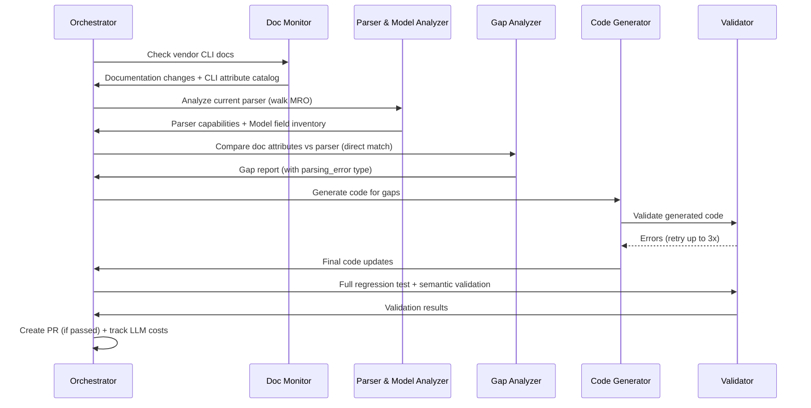

# Self-Sustaining Parser Validation & Update System - Design Proposal

**Version:** 3.0
**Date:** February 23, 2026
**Status:** Design Proposal (Post Phase 0 Learnings)
**Author:** ConfigZ Project Team

---

## Executive Summary

A multi-agent AI system that continuously monitors vendor CLI documentation, validates text-based configuration parsers against current syntax, identifies gaps, and autonomously updates Pydantic data models and parsers to maintain support for latest OS versions.

### Key Capabilities

- **Continuous Monitoring** - Automatically detect vendor CLI documentation changes and new OS releases
- **Structured Extraction** - Rule-based scraping of vendor command references with LLM fallback for ambiguous cases
- **Gap Analysis** - Direct comparison of documented CLI attributes against parser capabilities
- **Automated Code Generation** - Generate parser and data model updates with iterative refinement
- **Validation & Testing** - Multi-layer quality gates including semantic validation against vendor examples
- **Human-in-the-Loop** - Strategic oversight with autonomous execution
- **Continuous Learning** - Feedback loops that improve generation quality over time

### Expected Impact

- **70%+ reduction** in manual parser maintenance effort
- **<7 days** time-to-support for new OS versions
- **95%+ coverage** of vendor documentation
- **90%+ success rate** on automated code generation (via iterative refinement)

### Phase 0 Learning

> YANG models were evaluated as a primary attribute source during Phase 0 and **rejected**. YANG leaf names, hierarchy, and attribute sets diverge from CLI text config in ways that require unreliable translation (fuzzy matching, keyword inference). The system now uses **vendor CLI command references directly** — the same documentation that describes the exact keywords appearing in `show running-config` output. This eliminates guesswork and gives the system direct, authoritative knowledge of CLI syntax.

---

## Table of Contents

1. [System Architecture](#system-architecture)
2. [Detailed Component Design](#detailed-component-design)
3. [Data Models](#data-models-for-the-system)
4. [Implementation Phases](#implementation-phases)
5. [Operating Modes](#operating-modes)
6. [Key Technologies](#key-technologies--tools)
7. [Success Metrics](#success-metrics)
8. [Observability & Debugging](#observability--debugging)
9. [Security Considerations](#security-considerations)
10. [Risk Mitigation](#risk-mitigation)
11. [Future Enhancements](#future-enhancements)

---

## System Architecture

### High-Level Components

```
+-------------------------------------------------------------------+
|                    Orchestrator Agent                              |
|               (Workflow Coordination)                              |
+--------------------+----------------------------------------------+
                     |
     +---------------+--------------------------------------------+
     |                   Event Bus (Redis Streams)                |
     +--+------+----------+------------------+--------------+-----+
        |      |          |                  |              |
        v      v          v                  v              v
+--------+ +----------+ +---------+  +-----------+  +--------------+
| Doc    | | Parser & | | Gap     |  | Code      |  | Validation   |
| Monitor| | Model    | | Analysis|  | Generator |  | & Testing    |
| Agent  | | Analyzer | | Agent   |  | Agent     |  | Agent        |
+--------+ +----------+ +---------+  +-----------+  +--------------+
     |          |           |              |                |
     v          v           v              v                v
+-------------------------------------------------------------------+
|                   Data Storage Layer                               |
|  PostgreSQL: Documentation, Gaps, Feedback, LLM Usage Tracking    |
|  Redis: Caching, Event Bus                                        |
|  Git: Code Changes, Parser History                                |
|  Vector DB: Code Embeddings for RAG (Phase 3+)                    |
+-------------------------------------------------------------------+
```

### Design Principles

1. **CLI-Doc-First** - Vendor CLI command references are the single source of truth for what attributes exist. No YANG translation, no guesswork. The documentation that describes `show running-config` output is exactly what we use.
2. **Rule-Based Extraction, LLM Fallback** - Structured scraping extracts attributes deterministically from well-formatted doc pages. LLM is used only for ambiguous cases where rule-based extraction fails. This keeps the system predictable and auditable.
3. **Durable Workflows** - Multi-step pipelines checkpoint progress. Failures resume from the last completed step, not from scratch.
4. **Iterative Refinement** - Code generation uses a generate-validate-fix loop (up to 3 attempts) before escalating to humans.
5. **Earn the Complexity** - Start with simple infrastructure (SQLite, APScheduler). Add Temporal, Redis Streams, vector DB only when the simpler approach demonstrably hits limits.
6. **Observability by Default** - Structured logging, tracing, and execution audit trails from day one.

### Component Interactions



---

## Detailed Component Design

### 1. Documentation Monitor Agent

**Purpose:** Monitor vendor CLI command references for changes, extract structured attribute catalogs, and detect new OS versions.

#### Why CLI Docs Directly?

| Source | Pros | Cons | Verdict |
|--------|------|------|---------|
| **Vendor CLI command references** | Exact CLI keywords, authoritative, includes examples | HTML format varies, may need scraping | **Primary source** |
| **YANG models** | Machine-readable, typed | Names diverge from CLI, requires translation layer, guesswork | **Rejected after Phase 0** |
| **Vendor APIs** (DevNet, CVP) | Structured, reliable | Limited coverage, not all vendors | Supplementary for release notes |
| **RSS/Atom feeds** | Low-effort monitoring | No attribute data, just notifications | Supplementary for version alerts |

#### Documentation Sources

| Vendor/OS | Primary CLI Doc Source | URL Pattern |
|-----------|----------------------|-------------|
| Cisco IOS/IOS-XE | Command Reference Guides | cisco.com/c/en/us/td/docs/ios-xml/... |
| Cisco IOS-XR | Command Reference | cisco.com/c/en/us/td/docs/iosxr/... |
| Cisco NX-OS | Command Reference | cisco.com/c/en/us/td/docs/dcn/nx-os/... |
| Arista EOS | EOS User Manual (per-version) | arista.com/en/um-eos/ |

#### Extraction Strategy: Rule-Based First, LLM Fallback

The extraction pipeline has two tiers:

**Tier 1: Rule-Based Scraping (~80% of pages)**

Vendor CLI docs follow consistent patterns within a vendor. For example, Cisco command references have:
- A "Syntax Description" table with parameter names, descriptions, and types
- A "Command Default" section
- A "Command Modes" section identifying where the command appears
- Configuration examples

Rule-based scrapers use CSS selectors / XPath to extract these structured sections. Because the patterns are consistent within a vendor, one set of extraction rules covers most pages for that vendor.

```
Document Page
    |
    v
[CSS/XPath Selectors] --> Syntax Description Table
    |                      --> Parameter names, types, defaults
    |                      --> Command modes (router bgp, interface, etc.)
    |                      --> Version introduced
    |
    v
[Pattern Normalizer] --> Structured AttributeInfo objects
    |
    v
[Validation] --> Verify extracted data looks reasonable
    |             (has name, has type, command mode makes sense)
    |
    v
AttributeCatalog
```

**Tier 2: LLM-Assisted Extraction (~20% of pages)**

When rule-based extraction fails or produces low-confidence results:
- Page format doesn't match expected CSS selectors
- Extracted data fails validation (missing names, garbled types)
- New documentation format not yet handled by rules

The LLM receives the raw page content and a structured prompt asking for the same output format. Results are tagged with `extraction_method: "llm"` and `confidence: float` for audit.

**When to use LLM vs. rules:**

| Condition | Action |
|-----------|--------|
| CSS selectors extract valid table with >=3 attributes | Use rule-based result |
| CSS selectors find nothing or <3 attributes | Try LLM extraction |
| Rule-based extraction finds table but validation fails | Try LLM extraction |
| LLM extraction also fails validation | Flag for manual review |
| New vendor/OS type with no rules written yet | LLM-first until rules are built |

#### Architecture

```python
class DocumentationMonitorAgent:
    """
    Monitors vendor CLI documentation for changes.
    Extracts structured attribute catalogs using rule-based scraping
    with LLM fallback for ambiguous pages.
    """

    def __init__(self, storage, config):
        self.storage = storage
        self.config = config

        # Rule-based scrapers (one per vendor doc format)
        self.scrapers = {
            'cisco_ios': CiscoCLIDocScraper(os_type='ios'),
            'cisco_iosxe': CiscoCLIDocScraper(os_type='iosxe'),
            'cisco_iosxr': CiscoCLIDocScraper(os_type='iosxr'),
            'cisco_nxos': CiscoCLIDocScraper(os_type='nxos'),
            'arista_eos': AristaCLIDocScraper(os_type='eos'),
        }

        # LLM client for fallback extraction
        self.llm_client = LLMClient(config['llm_api_key'])

        # Vendor-specific version parsers
        self.version_parsers = {
            'cisco_iosxe': CiscoIOSXEVersionParser(),   # 17.09.04a
            'cisco_iosxr': CiscoIOSXRVersionParser(),   # 7.11.1
            'cisco_nxos': CiscoNXOSVersionParser(),     # 10.4(3)
            'arista_eos': AristaEOSVersionParser(),     # 4.32.2.1F
            'cisco_ios': CiscoIOSVersionParser(),       # 15.9(3)M7
        }
```

#### Scraper Design

Each vendor scraper implements:

```python
class CiscoCLIDocScraper:
    """
    Extracts attributes from Cisco CLI command reference pages.
    Targets the structured 'Syntax Description' tables that Cisco
    uses consistently across IOS, IOS-XE, IOS-XR, and NX-OS docs.
    """

    def extract_attributes(self, html_content, protocol) -> ExtractionResult:
        """
        Returns ExtractionResult with:
        - attributes: list[AttributeInfo] extracted by rules
        - confidence: float (0-1) based on extraction quality
        - needs_llm_review: bool
        """
        # 1. Find syntax description tables via CSS selectors
        # 2. Extract parameter rows (name, description, type/range)
        # 3. Find command mode section (where in config hierarchy)
        # 4. Find version-introduced info
        # 5. Extract configuration examples
        # 6. Validate: names present, types parseable, modes make sense
        ...

    def extract_command_syntax(self, html_content) -> list[str]:
        """Extract the EBNF-style syntax patterns vendors publish."""
        # e.g.: "neighbor {ip-address} remote-as {as-number}"
        ...

    def detect_changes(self, old_html, new_html) -> list[DocumentationChange]:
        """Diff two versions of the same doc page."""
        ...
```

#### Handling Documentation Format Changes

Vendor doc format changes are the #1 operational risk. Mitigations:

1. **Multiple selector strategies per vendor** - Primary CSS selectors + fallback XPath + structural heuristics. If one breaks, others may still work.
2. **Semantic content hashing** - Hash extracted content, not raw HTML. A page redesign that preserves content produces the same hash and doesn't trigger false changes.
3. **Scrape health monitoring** - Track extraction success rate per vendor. Alert when success drops below 90%.
4. **LLM fallback** - When rules fail, LLM can still read the page and extract attributes. This buys time to fix the scraper rules.
5. **Manual ingestion path** - Engineers can manually provide attribute data when automation fails entirely.

#### Output: CLI Attribute Catalog

The key output is an `AttributeCatalog` — a structured list of attributes for a given protocol/vendor/version, extracted directly from CLI docs:

```json
{
  "vendor": "arista",
  "os_type": "eos",
  "protocol": "bgp",
  "version": "4.32.2F",
  "source": "cli_docs",
  "source_url": "https://arista.com/en/um-eos/eos-bgp-commands",
  "extraction_method": "rule_based",
  "attributes": {
    "remote-as": {
      "name": "remote-as",
      "cli_syntax": "neighbor {ip} remote-as {asn}",
      "description": "Specify the AS number of the BGP neighbor",
      "cli_type": "ASN (1-4294967295)",
      "python_type_hint": "int",
      "command_mode": "router-bgp",
      "version_introduced": "4.20",
      "is_deprecated": false,
      "source_url": "https://arista.com/en/um-eos/eos-bgp-commands#remote-as",
      "extraction_confidence": 0.95
    },
    "soft-reconfiguration inbound": {
      "name": "soft-reconfiguration inbound",
      "cli_syntax": "neighbor {ip} soft-reconfiguration inbound [all]",
      "description": "Enable soft-reconfiguration for inbound updates",
      "cli_type": "keyword [optional-keyword]",
      "python_type_hint": "bool",
      "command_mode": "router-bgp",
      "version_introduced": "4.20",
      "is_deprecated": false,
      "source_url": "https://arista.com/en/um-eos/eos-bgp-commands#soft-reconfig",
      "extraction_confidence": 0.90
    }
  }
}
```

Note: attribute names are **exactly as they appear in CLI config text**. No translation needed. When the Gap Analyzer compares this to parser capabilities, it's comparing CLI keyword to CLI keyword.

---

### 2. Parser & Model Analyzer Agent

**Purpose:** Analyze current parser implementations AND Pydantic data models. Walks the class inheritance hierarchy (MRO) to capture inherited methods.

#### Key Capabilities

1. **MRO-Aware Analysis** - Walks Python Method Resolution Order to detect inherited parser methods (e.g., `EOSParser` inheriting `parse_ospf()` from `IOSParser`). For each method, records which class defines it and whether it's inherited.

2. **Bidirectional Analysis** - Analyzes parser-to-model (what parser populates) and model-to-parser (what model expects). Detects:
   - **Dead fields:** Defined in model but never populated by parser
   - **Shadow attributes:** Populated by parser but not defined in model
   - **Type mismatches:** Parser sets a string but model expects int

3. **Library-Agnostic Pattern Detection** - Detects parsing patterns from any library: `re.search/match`, ciscoconfparse2 (`re_search_children`, `re_match_iter_typed`), TTP templates, textfsm, or plain string operations.

#### Architecture

```
Parser Source Files (.py)
    |
    v
[Dynamic Import] --> Get MRO chain (e.g., EOSParser -> IOSParser -> BaseParser)
    |
    v
[AST Analysis per class] --> Extract parse_* methods with defining class
    |
    v
[Pattern Extraction] --> Regex patterns, ciscoconfparse2 calls, TTP templates
    |
    v
[Attribute Extraction] --> What dict keys / model fields does each method populate?
    |
    v
ParserCapabilities { protocol -> ProtocolCapability }
```

```
Model Source Files (.py)
    |
    v
[AST Analysis] --> Find Pydantic BaseModel subclasses
    |
    v
[Field Extraction] --> Field names, types, defaults, Optional flags
    |
    v
ModelInventory { model_class -> fields }
```

```
ParserCapabilities + ModelInventory
    |
    v
[Cross-Reference] --> dead_fields, shadow_attributes, type_mismatches
    |
    v
CrossReferenceResult
```

#### Output Example

```json
{
  "parser": "EOSParser", "os_type": "eos",
  "protocols": {
    "bgp": {
      "parsing_method": "parse_bgp",
      "defining_class": "EOSParser",
      "is_inherited": false,
      "attributes_supported": ["remote-as", "update-source", "route-map in", "route-map out"],
      "known_limitations": ["Does not parse soft-reconfiguration inbound all"]
    },
    "vrf": {
      "parsing_method": "parse_vrfs",
      "defining_class": "IOSParser",
      "is_inherited": true,
      "attributes_supported": ["name", "rd", "route-target import", "route-target export"],
      "known_limitations": ["INHERITED from IOSParser — uses 'vrf definition' but EOS uses 'vrf instance'"]
    }
  },
  "cross_reference": {
    "bgp": { "dead_fields": ["graceful_restart_time"], "shadow_attributes": [] }
  }
}
```

---

### 3. Gap Analysis Agent

**Purpose:** Compare CLI doc attribute catalogs with parser capabilities to identify gaps. Uses direct attribute name comparison — no fuzzy matching needed because both sides use CLI naming.

#### Why No Fuzzy Matching?

In v2, fuzzy matching was needed because YANG leaf names (`soft-reconfiguration`) had to be matched against Python attribute names (`soft_reconfig_all`) — different naming conventions. Now:

- **Doc attributes** use CLI naming: `soft-reconfiguration inbound`
- **Parser attributes** are extracted from code that parses CLI text, so they reference the same CLI keywords

The only normalization needed is trivial: lowercase, collapse whitespace. No probabilistic matching, no 85% thresholds, no false matches.

#### Gap Types

| Type | Description | Example |
|------|-------------|---------|
| `missing_protocol` | Entire protocol not parsed | VXLAN not parsed at all |
| `missing_attribute` | Attribute not captured by parser | `soft-reconfiguration inbound all` not extracted |
| `syntax_mismatch` | Parser uses wrong syntax pattern | `vrf definition` vs `vrf instance` on EOS |
| `parsing_error` | Parser handles attribute but produces wrong result | Wrong value when tested against vendor examples |
| `dead_field` | Model field exists but parser never populates it | `graceful_restart_time` defined, never set |
| `version_gap` | New OS version introduces changes not yet handled | EOS 4.36 adds new BGP options |

#### Architecture

```
CLI Attribute Catalog (from Doc Monitor)
    +
Parser Capabilities (from Parser Analyzer)
    +
Model Inventory (from Parser Analyzer)
    +
Vendor Config Examples (curated)
    |
    v
[Direct Attribute Comparison]
    |  - Normalize: lowercase, collapse whitespace
    |  - For each doc attribute: is it in parser's supported list?
    |  - For inherited methods: does the syntax actually work for this OS?
    |
    v
[Cross-Reference Check]
    |  - Dead fields from model inventory
    |  - Shadow attributes from parser analysis
    |
    v
[Semantic Validation] (if examples available)
    |  - Parse vendor examples with current parser
    |  - Compare output to expected values
    |  - Flag parsing_error gaps for wrong results
    |
    v
[Priority Scoring]
    |  - severity + protocol importance + gap type + breaking change
    |
    v
Sorted Gap List with Recommendations
```

#### Priority Scoring

```
Score (0-10) = severity_weight + protocol_weight + gap_type_weight + breaking_bonus

severity:  critical=4, high=3, medium=2, low=1
protocol:  bgp=3, ospf=2.5, vrf=2.5, vxlan=2, evpn=2, interface=2, route_map=2, acl=1.5
gap_type:  parsing_error=4, missing_protocol=3.5, syntax_mismatch=3, missing_attribute=2, dead_field=1
breaking:  +2 if breaking change

Capped at 10.0. Gaps with score >= 7.0 eligible for auto-update code generation.
```

---

### 4. Code Generator Agent

**Purpose:** Generate parser code, data model updates, and tests with iterative refinement and contextual code retrieval.

#### Key Capabilities

1. **Generate-Validate-Fix Loop** - Up to 3 iterations: generate code, validate (syntax + types + lint), feed errors back to LLM. Pushes success from ~80% (first attempt) to ~90%+ (after refinement).

2. **Contextual Code Retrieval** - Retrieves similar parser methods from the codebase as few-shot examples. Phase 1-2: file-based search. Phase 3+: vector DB if it shows measurable quality improvement.

3. **CLI-Doc-Informed Types** - Uses CLI documentation type descriptions ("INTEGER 1-65535", "WORD", "A.B.C.D") to infer correct Pydantic field types. No YANG type translation.

4. **Structured Diffs** - Generates readable unified diffs for every change, included in PR descriptions.

5. **LLM Usage Tracking** - Every LLM call tracked with purpose, model, tokens, cost, latency.

#### Architecture

```
Gap + CLI Attribute Catalog + Parser Capabilities
    |
    v
[Retrieve Similar Code] --> Find same-protocol methods in other parsers
    |
    v
[Build Prompt]
    |  - Gap description and target attribute
    |  - CLI syntax from vendor docs (exact keywords)
    |  - CLI type hints (INTEGER, WORD, A.B.C.D)
    |  - Target Pydantic model (current code)
    |  - Similar parser methods (few-shot examples)
    |  - Previous errors (if retry)
    |
    v
[LLM Generate] --> Model update + Parser update + Test update
    |
    v
[Quick Validate] --> AST parse, mypy, ruff
    |
    |-- Pass --> Generate diffs, return CodeUpdateBatch
    |
    |-- Fail --> Feed errors back to prompt, retry (max 3x)
    |
    |-- 3x Fail --> Return with remaining_errors, escalate to human
```

#### Type Inference from CLI Docs

| CLI Doc Type Pattern | Python Type | Example |
|---------------------|-------------|---------|
| `INTEGER`, `<1-65535>` | `int` | `remote-as <1-4294967295>` |
| `WORD`, `LINE` | `str` | `description LINE` |
| `A.B.C.D` | `IPv4Address` | `neighbor A.B.C.D` |
| `X:X:X::X` | `IPv6Address` | `neighbor X:X:X::X` |
| `A.B.C.D/M` | `IPv4Network` | `network A.B.C.D/M` |
| `HH:MM:SS` | `str` | `timers HH:MM:SS` |
| (keyword only, no argument) | `bool` | `soft-reconfiguration inbound` |
| `{option1 \| option2}` | `Literal["option1", "option2"]` | `mode {active \| passive}` |

---

### 5. Validation & Testing Agent

**Purpose:** Multi-layer quality gates including semantic validation against vendor examples.

#### Quality Gates

```
Generated Code
    |
    v
[1. Syntax] --> ast.parse() - is it valid Python?
    |
    v
[2. Type Check] --> mypy - do types match?
    |
    v
[3. Lint] --> ruff - code quality issues?
    |
    v
[4. Security] --> bandit - security issues?
    |              regexploit - ReDoS-vulnerable regex?
    |
    v
[5. Unit Tests] --> pytest - do generated tests pass?
    |
    v
[6. Semantic Validation] --> Parse vendor config examples
    |                         Compare output to expected values
    |                         Flag mismatches as parsing_error
    |
    v
[7. Regression Check] --> Run full existing test suite
    |                      Run config corpus integration tests
    |                      Compare object counts before/after
    |
    v
Pass --> Ready for PR
Fail --> Return errors (for refinement loop or human escalation)
```

#### ReDoS Detection

Uses `regexploit` (not a hand-rolled heuristic) because naive checks miss real ReDoS vectors like `(a|aa)+`, alternation with shared prefixes, and nested optional groups. Falls back to simple nested-quantifier heuristic only if regexploit is unavailable.

#### Config Corpus: Lifecycle & Ownership

The config corpus is anonymized, real-world device configurations used for integration testing.

**Who builds it:**
- **Initial (Phase 1):** Engineers contribute anonymized configs from test suites. Goal: 5-10 per OS type.
- **Organic growth:** Every merged PR adds its test config to the corpus (enforced by PR checklist).
- **New OS versions:** Task auto-created to add at least one config sample.

**Location:** `tests/corpus/{vendor}/{os_type}/` in the repo. Owned by parser team.

**Integration test mechanics:** Parse each corpus config before and after changes. Compare object counts per protocol. Any decrease = potential regression.

#### Golden Test Expected Values: Authorship

| Source | Phase | Accuracy |
|--------|-------|----------|
| **Manual curation** | Phase 1-2 (budgeted: 1-2 days per OS) | 100% |
| **LLM-assisted proposal** (human reviews) | Phase 3+ | ~80% before review |
| **PR-driven** (author writes expected values for fixed attribute) | Phase 2+ | 100% |

Scope: 5-10 expected values per example, not exhaustive. You test the attributes that matter, not every field.

---

### 6. Orchestrator Agent

**Purpose:** Coordinate agents, manage workflow state, create PRs, track LLM costs.

#### Workflow Steps

```
Step 1: Monitor vendor CLI docs              --> checkpoint
Step 2: Analyze parser (MRO) + models        --> checkpoint
Step 3: Gap analysis (direct comparison)      --> checkpoint
Step 4: Code generation (iterative, max 3x)   --> checkpoint [auto-update only]
Step 5: Validation & testing (all 7 gates)     --> checkpoint [auto-update only]
Step 6: Create PR with diffs + cost summary    [auto-update only]
```

Each step saves output to the database. On failure, the workflow resumes from the last completed step. Rollback available via CLI.

#### PR Description Includes

- Gaps addressed with links to vendor documentation
- Structured diffs for every changed file
- Validation results summary (all gates)
- Test results and coverage
- LLM usage summary (calls, tokens, cost for this cycle)
- Review checklist

#### Rollback

`python -m configz.validator rollback --cycle-id <id>` performs:
1. Git revert of the branch/PR
2. Reopen gaps in database (status: open)
3. Notify stakeholders via Slack/email

---

## Data Models for the System

### Documentation Layer

| Model | Purpose | Key Fields |
|-------|---------|------------|
| `AttributeInfo` | Single CLI attribute from vendor docs | `name` (CLI keyword), `cli_syntax`, `cli_type`, `python_type_hint`, `command_mode`, `description`, `version_introduced`, `is_deprecated`, `source_url`, `extraction_method` (rule_based/llm), `extraction_confidence` |
| `AttributeCatalog` | All attributes for a protocol/vendor/version | `vendor`, `os_type`, `protocol`, `version`, `attributes: dict[str, AttributeInfo]`, `source_url`, `extraction_method` |
| `DocumentationChange` | A single change detected between versions | `protocol`, `change_type`, `attribute`, `old_syntax`, `new_syntax`, `description`, `version_introduced`, `examples` |
| `DocumentationUpdate` | All changes for an OS version | `vendor`, `os_type`, `version`, `changes: list[DocumentationChange]` |
| `ConfigExample` | Vendor config with expected parse results | `name`, `os_type`, `protocol`, `config_text`, `expected_values: dict[str, str]`, `source_url` |

### Parser & Model Analysis Layer

| Model | Purpose | Key Fields |
|-------|---------|------------|
| `ParsingPattern` | Regex/pattern extracted from code | `pattern`, `purpose`, `captures`, `source_library` (re/ciscoconfparse2/ttp/etc.) |
| `ProtocolCapability` | What a parser handles for one protocol | `protocol`, `parsing_method`, `defining_class`, `is_inherited`, `attributes_supported`, `patterns`, `known_limitations` |
| `ParserCapabilities` | Complete parser analysis | `os_type`, `parser_class`, `protocols: dict[str, ProtocolCapability]`, `version_support` |
| `ModelFieldInfo` | Single Pydantic model field | `name`, `type_annotation`, `default_value`, `is_optional` |
| `ModelInventory` | All model fields for a protocol | `protocol`, `models: dict[str, dict[str, ModelFieldInfo]]` |
| `CrossReferenceResult` | Parser vs Model comparison | `dead_fields`, `shadow_attributes`, `type_mismatches` |

### Gap Analysis Layer

| Model | Purpose | Key Fields |
|-------|---------|------------|
| `GapAnalysis` | A detected gap | `gap_id`, `protocol`, `gap_type` (6 types), `severity` (4 levels incl. critical), `description`, `priority_score`, `recommendation` |
| `Recommendation` | How to fix a gap | `action`, `data_model_changes`, `parser_changes`, `test_changes`, `estimated_effort`, `breaking_change` |

### Code Generation Layer

| Model | Purpose | Key Fields |
|-------|---------|------------|
| `CodeUpdate` | Single file change | `file_path`, `change_type`, `old_code`, `new_code`, `diff`, `description`, `related_gap_id` |
| `CodeUpdateBatch` | All changes for one gap | `gap_id`, `updates`, `summary`, `generation_attempts`, `remaining_errors` |

### Validation Layer

| Model | Purpose | Key Fields |
|-------|---------|------------|
| `ValidationResult` | Code quality check | `syntax_valid`, `type_check_passed`, `lint_issues`, `security_issues`, `redos_vulnerable_patterns` |
| `SemanticValidationResult` | Vendor example verification | `passed`, `examples_tested`, `examples_passed`, `results` |
| `TestResult` | Pytest results | `passed`, `failures`, `coverage`, `execution_time`, `test_count` |
| `RegressionResult` | Regression check | `regression_detected`, `affected_tests`, `corpus_regressions` |

### LLM Usage Tracking

| Model | Purpose | Key Fields |
|-------|---------|------------|
| `LLMCallRecord` | Single API call | `cycle_id`, `gap_id`, `model`, `purpose`, `prompt_tokens`, `completion_tokens`, `estimated_cost`, `latency_ms`, `success` |
| `LLMCycleUsage` | Aggregated per cycle | `total_calls`, `total_tokens`, `estimated_cost`, `refinement_attempts` |

### Feedback & Learning

| Model | Purpose | Key Fields |
|-------|---------|------------|
| `CodeReviewFeedback` | Human review outcome | `reviewer`, `outcome` (approved/changes_requested/rejected), `human_modifications` |
| `GenerationOutcome` | End-to-end result | `generated_successfully`, `validation_passed`, `pr_merged`, `refinement_attempts` |

### Cycle Result

| Model | Purpose | Key Fields |
|-------|---------|------------|
| `ValidationCycleResult` | Complete cycle output | `cycle_id`, `status`, `gaps_count`, `pr_url`, `duration`, `llm_usage`, `error` |

---

## Implementation Phases

### Phase 0: Proof of Concept (2-3 weeks) - REVISED

**Goal:** Validate CLI doc scraping accuracy and code generation quality.

**What changed from v2:** Phase 0 originally tested YANG model extraction. After YANG was rejected, Phase 0 now validates the rule-based scraping approach.

**Week 1: Scraper PoC**
- Build a rule-based scraper for Arista EOS BGP command reference
- Extract attributes, types, and syntax patterns
- Manually verify: does the extracted catalog match reality?
- Measure: extraction accuracy, coverage, false attributes

**Week 2: Code Generation PoC**
- Use extracted attributes to identify 3-5 real gaps in EOSParser
- Test code generation with Claude API for these gaps
- Measure first-attempt and post-refinement success rates

**Week 3: Evaluation**
- Does rule-based extraction cover >=80% of attributes on target pages?
- Does code generation pass validation on >=60% of first attempts?
- Go/no-go for Phase 1

### Infrastructure Simplification Strategy

Start simple. Earn the complexity.

| Phase | Data Store | Workflow | Event Bus | Code Search | Observability |
|-------|-----------|----------|-----------|-------------|---------------|
| **Phase 0** | SQLite | Plain scripts | None | None | Print/logging |
| **Phase 1** | PostgreSQL | APScheduler + async | None | File-based grep | structlog |
| **Phase 2** | PostgreSQL | APScheduler + state machine | Redis (cache only) | File-based grep | structlog + metrics |
| **Phase 3** | PostgreSQL | DB-backed checkpoints | Redis (cache) | Vector DB (if measurable improvement) | OpenTelemetry |
| **Phase 4** | PostgreSQL | Temporal (only if needed) | Redis Streams (only if needed) | Vector DB | Full observability |

**Decision gates:** Temporal only if >3 workflow failures lose work. Redis Streams only if sequential execution is a bottleneck. Vector DB only if file search produces measurably worse generation.

---

### Phase 1: Foundation (4-6 weeks)

**Goal:** Core infrastructure, scraper framework, MRO-aware parser analysis.

**Week 1-2: Infrastructure**
- Project structure, PostgreSQL schema
- Structured logging (structlog)
- LLM usage tracking module
- CLI framework for triggering analyses

**Week 3-4: Documentation Monitor Agent**
- Scraper framework with vendor-specific CSS/XPath rules
- LLM fallback extraction pipeline
- Vendor-specific version parsers
- Content hashing for semantic change detection
- Scraper health monitoring (success rate tracking)

**Week 5-6: Parser & Model Analyzer Agent**
- MRO-aware parser analysis
- Library-agnostic pattern detection
- Pydantic model field extraction
- Cross-reference reports

**Deliverables:** Working scraper for Arista EOS + Cisco IOS-XE. MRO-aware parser reports. Cross-reference reports.

---

### Phase 2: Analysis & Detection (3-4 weeks)

**Goal:** Gap analysis, semantic validation, reporting dashboard.

**Week 7-8: Gap Analysis Agent**
- Direct attribute comparison (no fuzzy matching)
- All 6 gap types including `parsing_error` and `dead_field`
- Semantic validation against vendor config examples
- Priority scoring
- Manual curation of initial golden test examples (budgeted: 1-2 days per OS)

**Week 9-10: Dashboard & Integration**
- Streamlit dashboard with gap reports and trend analysis
- Slack/email alerts for critical gaps
- End-to-end testing

---

### Phase 3: Code Generation (6-8 weeks)

**Goal:** Automated code generation with iterative refinement.

**Week 11-13: Code Generator Agent**
- Generate-validate-fix loop (3 attempts max)
- CLI-doc-informed type inference
- Contextual code retrieval (file-based, vector DB if justified)
- Structured diff generation
- LLM usage tracking

**Week 14-16: Validation & Testing Agent**
- All 7 quality gates
- Semantic golden tests
- regexploit ReDoS detection
- Config corpus integration testing
- Property-based testing with Hypothesis

**Week 17-18: Integration & optimization**
- End-to-end pipeline
- Prompt optimization
- Target: 90%+ generation success rate

---

### Phase 4: Automation & Learning (4-6 weeks)

**Goal:** Full automation, PR creation, feedback loops.

**Week 19-21: Orchestrator**
- Workflow with DB-backed checkpoints
- PR creation with diffs, validation summary, LLM costs
- Rollback command
- Scheduling for all operating modes

**Week 22-23: Learning**
- Feedback capture (CodeReviewFeedback, GenerationOutcome)
- Prompt effectiveness tracking
- Scraper rule improvement from failed extractions

**Week 24: Production**
- Docker deployment
- Monitoring dashboards
- Runbooks
- Go live with Arista EOS pilot

---

## Operating Modes

### Mode 1: Continuous Monitoring (Always On)

| Aspect | Detail |
|--------|--------|
| **Schedule** | Daily at 2 AM UTC |
| **Scope** | Check vendor CLI doc pages for changes (content hash comparison) |
| **Action** | Alert on changes via Slack/email |
| **Human** | Review alerts weekly |

### Mode 2: Periodic Validation (Weekly/Monthly)

| Aspect | Detail |
|--------|--------|
| **Schedule** | Weekly for IOS/IOS-XE/EOS, Monthly for IOS-XR/NX-OS |
| **Scope** | Full gap analysis with semantic validation |
| **Action** | Gap reports with trend analysis |
| **Human** | Review reports, prioritize fixes |

### Mode 3: Auto-Update (Triggered)

| Aspect | Detail |
|--------|--------|
| **Trigger** | New OS version detected OR manual |
| **Scope** | Full analysis + code gen + PR |
| **Threshold** | Gaps scoring >= 7.0 |
| **Human** | Review and approve PR (auto-merge always disabled) |

### Mode 4: On-Demand

```bash
$ python -m configz.validator analyze --os-type eos --protocol bgp --generate-code
```

---

## Key Technologies & Tools

### Core Stack

| Category | Technology | Purpose |
|----------|-----------|---------|
| **Language** | Python 3.11+ | Core implementation |
| **AI/LLM** | Claude API (Anthropic) | Code generation, fallback doc extraction |
| **Config Parsing** | ciscoconfparse2, TTP | Parse CLI text configs (library-agnostic) |

### Web Scraping & Extraction

| Tool | Purpose |
|------|---------|
| **BeautifulSoup4** | HTML parsing for vendor doc pages |
| **Scrapy** | Large-scale doc scraping with rate limiting |
| **Playwright** | JavaScript-heavy doc sites (dynamic rendering) |
| **httpx** | Async HTTP client for API-based doc sources |

### Data & Storage

| Technology | Purpose |
|-----------|---------|
| **PostgreSQL** | Primary data: docs, gaps, feedback, LLM tracking, workflow state |
| **Redis** | Caching, event bus (Phase 3+) |
| **Vector DB** (Phase 3+) | Code embeddings for contextual retrieval (only if justified) |
| **Git** | Code history, parser versioning |

### Analysis & Quality

| Tool | Purpose |
|------|---------|
| **ast** (stdlib) | Python AST analysis for parser/model inspection |
| **mypy** | Type checking generated code |
| **ruff** | Fast linting |
| **bandit** | Security scanning |
| **regexploit** | ReDoS vulnerability detection |
| **Hypothesis** | Property-based testing (generates inputs from Pydantic types) |

### Orchestration

| Tool | Purpose |
|------|---------|
| **APScheduler** | Job scheduling (Phase 1-3) |
| **Temporal** | Durable workflows (Phase 4, only if needed) |

### Deployment

| Tool | Purpose |
|------|---------|
| **Docker** | Containerization |
| **GitHub Actions** | CI/CD |
| **OpenTelemetry** | Distributed tracing (Phase 3+) |

---

## Success Metrics

### System Performance

| Metric | Target | Measurement |
|--------|--------|-------------|
| Documentation Coverage | 95%+ | % of vendor CLI doc pages monitored |
| Scraper Extraction Accuracy | 90%+ | % of attributes correctly extracted (sampled monthly) |
| Change Detection Latency | < 24 hours | Time from doc update to detection |
| Gap Detection Accuracy | 90%+ | % of real gaps identified (validated by humans) |
| False Positive Rate | < 10% | % of non-gaps flagged |
| Code Generation Success | 90%+ | % passing validation after refinement loop |
| Time to Update | < 7 days | OS release to parser update PR |
| Regression Rate | < 5% | % of updates causing regressions |

### Business Impact

| Metric | Current | Target | Improvement |
|--------|---------|--------|-------------|
| Time to support new OS | 30-60 days | < 7 days | 8-10x faster |
| Manual effort | 100 hrs/quarter | 30 hrs/quarter | 70% reduction |
| Protocol coverage | 11 protocols | 15+ protocols | 36%+ increase |
| Parser accuracy | 95% | 98%+ | 3% improvement |

### LLM Usage Metrics

| Metric | Target | Purpose |
|--------|--------|---------|
| Cost per gap resolved | Track | Budget planning |
| Tokens per generation attempt | Track | Prompt optimization |
| Refinement success rate | 80%+ | % of failed first attempts fixed by retry |
| LLM extraction fallback rate | <20% | % of doc pages requiring LLM extraction (lower = better rules) |

---

## Observability & Debugging

### Structured Logging

All agents use structured JSON logging with correlation IDs (cycle_id, gap_id). Every scraping attempt, extraction result, gap detected, LLM call, and validation outcome is logged.

### Scraper Health Dashboard

Unique to the CLI-doc-first approach: track extraction quality over time.

| Metric | Alert Threshold | Purpose |
|--------|-----------------|---------|
| Extraction success rate per vendor | < 90% | Detect doc format changes |
| LLM fallback rate | > 30% | Rules need updating |
| Average extraction confidence | < 0.8 | Quality degradation |
| Pages with zero attributes extracted | Any | Immediate investigation |

### Execution Audit Trail

Every cycle stores in PostgreSQL:
- What doc pages were scraped (URLs, response codes, content hashes)
- What attributes were extracted (with confidence scores and extraction method)
- What gaps were detected (with full context)
- What code was generated (with prompts and LLM responses)
- What validation results occurred
- LLM usage details (model, tokens, cost, latency per call)

### Debugging Workflow

1. **Find the cycle:** `SELECT * FROM validation_cycles WHERE cycle_id = '...'`
2. **Check extraction results:** `SELECT * FROM extractions WHERE cycle_id = '...'` — see which pages used rules vs LLM
3. **Review LLM calls:** `SELECT * FROM llm_calls WHERE cycle_id = '...'`
4. **Replay step:** `python -m configz.validator replay --cycle-id ... --step 3`

---

## Security Considerations

### Input Sanitization

- **Scraped HTML:** Vendor doc pages may contain JavaScript, iframes, or unexpected markup. All content is sanitized (bleach/html-sanitizer) before storage or LLM ingestion.
- **LLM prompt injection:** Scraped content is enclosed in clearly delimited blocks within prompts. System instructions are separated from scraped data.
- **ReDoS:** All generated regex checked with regexploit before inclusion in PRs.

### Generated Code Safety

- No generated code runs on production without human review
- All generated code passes bandit security scanning
- Staging environment for test execution is isolated

### Secret Management

- API keys stored in environment variables or secrets manager
- No secrets in code, configs, or logs
- GitHub bot account uses fine-grained permissions (repo scope only)

---

## Risk Mitigation

### Technical Risks

| Risk | Level | Probability | Mitigation |
|------|-------|-------------|------------|
| **Documentation format changes break scrapers** | HIGH | 60% | Multiple selector strategies per vendor, LLM fallback, scraper health monitoring, manual ingestion path |
| Code generation produces incorrect logic | MEDIUM | 40% | Iterative refinement (3x), semantic validation, human review on all PRs |
| Regressions in existing parsers | MEDIUM | 20% | Full regression suite, config corpus testing, easy rollback |
| LLM API outages | LOW | 10% | Graceful degradation: scraping continues (rule-based), code gen deferred |
| Scraper blocked by vendor (rate limiting, bot detection) | MEDIUM | 30% | Respectful crawling (delays, robots.txt), cache aggressively, fallback to manual download |

### Operational Risks

| Risk | Level | Mitigation |
|------|-------|------------|
| Infrastructure complexity vs. team size | MEDIUM | Earn-the-complexity strategy: SQLite -> PostgreSQL -> Temporal only when needed |
| Golden test maintenance burden | MEDIUM | LLM-assisted proposals (Phase 3+), PR-driven growth, scoped to tested attributes |
| Config corpus staleness | LOW | Growth enforced via PR checklist, new-version tasks auto-created |
| False positives waste reviewer time | LOW | Direct matching (not fuzzy), confidence scoring, threshold tuning |
| System maintenance burden | MEDIUM | Modular design, comprehensive tests, runbooks, 20% time allocation |

### Contingency Plans

- **Scraper completely broken for a vendor:** Switch to LLM-only extraction temporarily. Fix rules within 1-2 days.
- **Validation loop exhausted (3x failure):** Escalate to human with full context (prompt, errors, attempts).
- **Regression detected post-merge:** `python -m configz.validator rollback --cycle-id <id>`
- **LLM costs spike:** Alert at 80% budget. Switch to cheaper model for non-critical tasks (extraction fallback).

---

## Human-in-the-Loop Touchpoints

| Decision | Auto? | Human Required? |
|----------|-------|-----------------|
| Create gap report | Yes | No (notification only) |
| Generate code for gaps (score >= 7.0) | Yes | Review PR |
| Create PR | Yes | Approve PR |
| Merge PR | No | Always |
| Deploy to production | No | Always |
| Breaking change | No | Always + lead approval |
| Rollback | No | Always |
| New scraper rules for vendor format change | No | Always |
| Adjust priority weights | No | Quarterly review |

---

## Future Enhancements

| Enhancement | Quarter | Effort | Description |
|-------------|---------|--------|-------------|
| Multi-Vendor Correlation | Q3 2026 | 6 weeks | Detect similar features across vendors, suggest unified abstractions |
| Predictive Analysis | Q4 2026 | 8 weeks | Predict deprecations from release patterns |
| Natural Language Queries | Q1 2027 | 4 weeks | "Does our EOS parser support BGP graceful restart?" |
| Automated Documentation | Q1 2027 | 6 weeks | Generate parser support matrices from code analysis |
| Configuration Migration | Q2 2027 | 8 weeks | Suggest config migrations between OS versions |
| Real-Time Config Validation | Q3 2027 | 4 weeks | Pre-deployment validation in CI/CD |
| Dependency Graph Visualization | Q3 2027 | 10 weeks | Neo4j-based config dependency graphs |

---

## Conclusion

### What Changed: v2 -> v3

| Area | v2 | v3 |
|------|----|----|
| **Attribute source** | YANG models (primary) | Vendor CLI command references (primary) |
| **Extraction method** | pyang YANG parser | Rule-based HTML scraping + LLM fallback |
| **Attribute matching** | Fuzzy matching (thefuzz, 85% threshold) | Direct comparison (names already match CLI) |
| **CLI keyword mapping** | 3-tier inference (direct + lookup + LLM) | Not needed — attributes ARE CLI keywords |
| **Type inference** | YANG types (uint32, inet:ipv4-address) | CLI doc patterns (INTEGER, A.B.C.D, WORD) |
| **Dependencies** | pyang, libyang, thefuzz | BeautifulSoup4, Scrapy, Playwright |
| **Confidence model** | Translation confidence (YANG -> CLI) | Extraction confidence (scraper accuracy) |
| **Key risk** | YANG-CLI divergence (guesswork) | Doc format changes (mitigated by LLM fallback) |
| **Phase 0 validates** | YANG extraction accuracy | Scraper extraction accuracy |

### What's Preserved from v2

Everything not related to YANG/fuzzy matching carries forward unchanged:

- MRO-aware parser analysis with bidirectional cross-reference
- Library-agnostic pattern detection (ciscoconfparse2, TTP, regex)
- 6 gap types including `parsing_error` and `dead_field`
- Generate-validate-fix loop (3 attempts, 90%+ success target)
- Semantic validation against vendor examples
- regexploit ReDoS detection + config corpus testing
- Durable workflows with checkpoints
- LLM usage tracking
- Earn-the-complexity infrastructure strategy
- Config corpus lifecycle and golden test authorship model
- Feedback and learning data models

### Expected Impact

| Metric | Current | Target | Improvement |
|--------|---------|--------|-------------|
| Time to support new OS | 30-60 days | < 7 days | **8-10x faster** |
| Manual effort | 100 hrs/quarter | 30 hrs/quarter | **70% reduction** |
| Protocol coverage | 11 protocols | 15+ protocols | **36%+ increase** |
| Code generation success | N/A | 90%+ (after refinement) | - |
| Parser accuracy | 95% | 98%+ | **3% improvement** |

### Next Steps

1. **Approve v3 Design** - Review this proposal
2. **Phase 0 (revised)** - 2-3 week PoC: build scraper for Arista EOS BGP docs, test code generation
3. **Go/No-Go** - Based on scraper accuracy and generation success
4. **Phase 1 Kickoff** - Foundation implementation
5. **Iterate** - Learn from each phase, adjust

### Investment Required

**Total Estimated Effort:** 21-29 weeks (including Phase 0)
**Team Size:** 2-3 engineers + 0.5 engineering lead
**Infrastructure Costs:** ~$500-1,500/month (LLM API, hosting, storage)
**Maintenance:** ~20% of original effort annually

---

**Recommendation:** Start with revised Phase 0 — build a rule-based scraper for Arista EOS BGP command reference pages. Validate extraction accuracy (>=80% of attributes correctly identified) and code generation quality (>=60% first-attempt success) before committing to full build.
