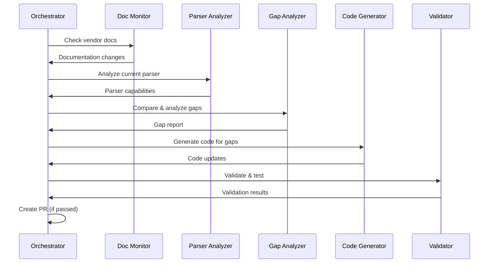

# Self-Sustaining Parser Validation & Update System - Design Proposal

**Version:** 1.0
**Date:** February 21, 2026
**Status:** Design Proposal
**Author:** ConfigZ Project Team

---

## Executive Summary

A multi-agent AI system that continuously monitors vendor documentation, validates parsers against current syntax, identifies gaps, and autonomously updates data models and parsers to maintain support for latest OS versions.

### Key Capabilities

✅ **Continuous Monitoring** - Automatically detect vendor documentation changes
✅ **Gap Analysis** - Identify missing features and unsupported syntax
✅ **Automated Code Generation** - Generate parser and data model updates
✅ **Validation & Testing** - Ensure code quality and prevent regressions
✅ **Human-in-the-Loop** - Strategic oversight with autonomous execution

### Expected Impact

- **70%+ reduction** in manual parser maintenance effort
- **<7 days** time-to-support for new OS versions
- **95%+ coverage** of vendor documentation
- **80%+ success rate** on automated code generation

---

## Table of Contents

1. [System Architecture](#system-architecture)
2. [Detailed Component Design](#detailed-component-design)
3. [Data Models](#data-models-for-the-system)
4. [Implementation Phases](#implementation-phases)
5. [Operating Modes](#operating-modes)
6. [Key Technologies](#key-technologies--tools)
7. [Success Metrics](#success-metrics)
8. [Risk Mitigation](#risk-mitigation)
9. [Future Enhancements](#future-enhancements)

---

## System Architecture

### High-Level Components

```
┌─────────────────────────────────────────────────────────────┐
│                    Orchestrator Agent                        │
│              (Coordinates all activities)                    │
└──────────────────┬──────────────────────────────────────────┘
                   │
        ┌──────────┼──────────┬──────────────┬────────────────┐
        │          │           │              │                │
        ▼          ▼           ▼              ▼                ▼
┌──────────┐ ┌──────────┐ ┌─────────┐ ┌───────────┐ ┌──────────────┐
│ Doc      │ │ Parser   │ │ Gap     │ │ Code      │ │ Validation   │
│ Monitor  │ │ Analyzer │ │ Analysis│ │ Generator │ │ & Testing    │
│ Agent    │ │ Agent    │ │ Agent   │ │ Agent     │ │ Agent        │
└──────────┘ └──────────┘ └─────────┘ └───────────┘ └──────────────┘
     │            │             │            │              │
     ▼            ▼             ▼            ▼              ▼
┌─────────────────────────────────────────────────────────────┐
│                   Data Storage Layer                         │
│  (Documentation, Parser Metadata, Gap Tracking, History)    │
└─────────────────────────────────────────────────────────────┘
```

### Component Interactions



---

## Detailed Component Design

### 1. Documentation Monitor Agent

**Purpose:** Continuously monitor vendor documentation for syntax changes, new features, and version releases.

#### Capabilities

**Web Scraping & Monitoring:**
- Periodic scraping of vendor documentation sites
  - Cisco IOS/IOS-XE release notes
  - Arista EOS documentation updates
  - Cisco IOS-XR/NX-OS documentation
- RSS feed monitoring
- Git repository tracking (for open documentation)

**Change Detection:**
- Track documentation versions and update dates
- Diff between documentation versions
- Extract new configuration commands
- Identify deprecated syntax
- Detect version-specific features

**Structured Extraction:**
- Parse HTML/PDF documentation
- Extract command syntax (EBNF/regex patterns)
- Extract attribute definitions with types
- Extract version requirements
- Capture configuration examples

#### Implementation

```python
class DocumentationMonitorAgent:
    """
    Monitors vendor documentation for changes.
    """

    def __init__(self, storage, config):
        self.storage = storage
        self.config = config
        self.scrapers = {
            'cisco_ios': CiscoIOSDocScraper(),
            'arista_eos': AristaEOSDocScraper(),
            'cisco_iosxr': CiscoIOSXRDocScraper(),
            'cisco_nxos': CiscoNXOSDocScraper(),
        }

    async def monitor_vendor_docs(
        self,
        vendor: str,
        os_type: str,
        force_update: bool = False
    ) -> DocumentationUpdate:
        """
        Check for documentation updates.

        Args:
            vendor: Vendor name (cisco, arista, etc.)
            os_type: OS type (ios, eos, iosxr, nxos)
            force_update: Force re-scraping even if no changes detected

        Returns:
            DocumentationUpdate with:
            - version: OS version
            - date: Release date
            - changes: List of syntax changes
            - new_features: New configuration objects
            - deprecated: Deprecated syntax
        """
        scraper = self.scrapers.get(f"{vendor}_{os_type}")
        if not scraper:
            raise ValueError(f"No scraper for {vendor} {os_type}")

        # Get last known version from storage
        last_version = await self.storage.get_last_documented_version(
            vendor, os_type
        )

        # Check for new documentation
        latest_version = await scraper.get_latest_version()

        if force_update or latest_version > last_version:
            # Scrape new documentation
            doc_content = await scraper.scrape_documentation(latest_version)

            # Extract changes
            changes = await self._detect_changes(
                last_version, latest_version, doc_content
            )

            # Store updates
            await self.storage.save_documentation_update(
                vendor, os_type, latest_version, changes
            )

            return DocumentationUpdate(
                vendor=vendor,
                os_type=os_type,
                version=latest_version,
                date=datetime.now(),
                changes=changes
            )

        return None  # No updates

    async def extract_syntax_definitions(
        self,
        doc_url: str,
        protocol: str
    ) -> SyntaxDefinition:
        """
        Extract syntax definitions from documentation.

        Args:
            doc_url: URL to protocol documentation
            protocol: Protocol name (bgp, ospf, etc.)

        Returns:
            SyntaxDefinition with:
            - command_syntax: EBNF or regex pattern
            - attributes: List of attributes and types
            - examples: Configuration examples
            - version_introduced: OS version
        """
        # Fetch documentation
        html_content = await self._fetch_documentation(doc_url)

        # Parse command syntax sections
        syntax_blocks = await self._parse_syntax_blocks(html_content)

        # Extract attributes and types
        attributes = await self._extract_attributes(syntax_blocks)

        # Extract examples
        examples = await self._extract_examples(html_content)

        # Determine version requirements
        version = await self._extract_version_info(html_content)

        return SyntaxDefinition(
            protocol=protocol,
            command_syntax=syntax_blocks,
            attributes=attributes,
            examples=examples,
            version_introduced=version,
            documentation_url=doc_url
        )

    async def _detect_changes(
        self,
        old_version: str,
        new_version: str,
        new_doc_content: dict
    ) -> list[DocumentationChange]:
        """
        Detect changes between documentation versions.
        """
        changes = []

        # Get old documentation from storage
        old_doc = await self.storage.get_documentation(old_version)

        # Compare command references
        new_commands = set(new_doc_content['commands']) - set(old_doc['commands'])
        deprecated_commands = set(old_doc['commands']) - set(new_doc_content['commands'])

        for cmd in new_commands:
            changes.append(DocumentationChange(
                protocol=self._extract_protocol(cmd),
                change_type=ChangeType.NEW_ATTRIBUTE,
                attribute=cmd,
                new_syntax=new_doc_content['syntax'][cmd],
                description=new_doc_content['descriptions'][cmd],
                version_introduced=new_version,
                documentation_url=new_doc_content['urls'][cmd]
            ))

        for cmd in deprecated_commands:
            changes.append(DocumentationChange(
                protocol=self._extract_protocol(cmd),
                change_type=ChangeType.DEPRECATED,
                attribute=cmd,
                old_syntax=old_doc['syntax'][cmd],
                description=f"Deprecated in {new_version}",
                version_introduced=new_version,
                documentation_url=""
            ))

        return changes
```

#### Data Sources

**Primary Sources:**
- Cisco DevNet APIs (where available)
- Arista CloudVision Portal (CVP) APIs
- Vendor documentation portals (HTTPS)
- GitHub repositories (open documentation)

**Secondary Sources:**
- RSS/Atom feeds for release notes
- Mailing lists
- Community forums (Reddit, Network Engineering forums)

**Fallback:**
- Web scraping (BeautifulSoup, Scrapy, Selenium)
- Manual updates (human-triggered)

#### Output Example

```json
{
  "vendor": "arista",
  "os_type": "eos",
  "version": "4.36.0F",
  "release_date": "2026-03-15",
  "documentation_url": "https://arista.com/en/um-eos/eos-4-36",
  "documentation_changes": [
    {
      "protocol": "bgp",
      "change_type": "new_attribute",
      "attribute": "soft-reconfiguration inbound all",
      "old_syntax": null,
      "new_syntax": "neighbor <ip> soft-reconfiguration inbound all",
      "description": "Enable soft-reconfiguration for all address families globally",
      "version_introduced": "4.36.0F",
      "documentation_url": "https://arista.com/en/um-eos/eos-4-36-bgp#soft-reconfig",
      "examples": [
        "router bgp 65000\n   neighbor 10.1.1.1 remote-as 65001\n   neighbor 10.1.1.1 soft-reconfiguration inbound all"
      ]
    },
    {
      "protocol": "vxlan",
      "change_type": "new_protocol",
      "attribute": "vxlan flood vtep",
      "new_syntax": "interface Vxlan1\n   vxlan flood vtep <ip-list>",
      "description": "Configure VXLAN flood list for BUM traffic",
      "version_introduced": "4.36.0F",
      "documentation_url": "https://arista.com/en/um-eos/eos-4-36-vxlan",
      "examples": [
        "interface Vxlan1\n   vxlan flood vtep 10.1.1.1 10.1.1.2"
      ]
    }
  ]
}
```

---

### 2. Parser Analyzer Agent

**Purpose:** Analyze current parser implementations to understand what they support.

#### Capabilities

**Code Analysis:**
- Parse parser Python code using AST (Abstract Syntax Tree)
- Extract parsing methods and their implementation
- Identify regex patterns used for parsing
- Map parsing logic to data models
- Trace data flow from config text to Pydantic models

**Coverage Mapping:**
- Map parser methods to protocols
- Extract regex patterns and what they capture
- Identify supported attributes per protocol
- Detect version-specific code paths
- Find conditional parsing logic

**Capability Documentation:**
- Generate structured representation of parser capabilities
- Create protocol-to-method mapping
- Document regex patterns and their purpose
- Identify known limitations from code comments
- Build version support matrix

#### Implementation

```python
import ast
import re
from pathlib import Path
from typing import Any

class ParserAnalyzerAgent:
    """
    Analyzes existing parser implementations.
    """

    def __init__(self, storage, project_root: Path):
        self.storage = storage
        self.project_root = project_root
        self.parsers_dir = project_root / "configz" / "parsers"
        self.models_dir = project_root / "configz" / "models"

    async def analyze_parser(self, parser_class: str) -> ParserCapabilities:
        """
        Analyze parser implementation.

        Args:
            parser_class: Parser class name (e.g., "IOSParser", "EOSParser")

        Returns:
            ParserCapabilities with:
            - os_type: OS type
            - protocols: List of supported protocols
            - methods: Parsing methods and patterns
            - attributes: Extracted attributes per protocol
            - version_support: Supported OS versions
        """
        # Load parser source code
        parser_file = self.parsers_dir / f"{parser_class.lower().replace('parser', '_parser')}.py"
        with open(parser_file, 'r') as f:
            source_code = f.read()

        # Parse AST
        tree = ast.parse(source_code)

        # Find parser class
        parser_node = self._find_class_node(tree, parser_class)

        # Extract all parsing methods
        parsing_methods = self._extract_parsing_methods(parser_node)

        # Analyze each method
        protocols = {}
        for method_name, method_node in parsing_methods.items():
            protocol_name = self._method_name_to_protocol(method_name)
            capability = await self._analyze_parsing_method(
                method_name, method_node, source_code
            )
            protocols[protocol_name] = capability

        # Extract version support from docstrings/comments
        version_support = self._extract_version_support(parser_node, source_code)

        # Determine OS type
        os_type = self._extract_os_type(parser_node, source_code)

        return ParserCapabilities(
            os_type=os_type,
            parser_class=parser_class,
            protocols=protocols,
            version_support=version_support,
            last_analyzed=datetime.now()
        )

    async def extract_parsing_patterns(
        self,
        method_code: str
    ) -> list[ParsingPattern]:
        """
        Extract regex patterns and syntax rules from method code.

        Args:
            method_code: Source code of parsing method

        Returns:
            List of ParsingPattern objects with:
            - pattern: The regex pattern
            - purpose: What it's trying to match
            - captures: What groups it extracts
        """
        patterns = []

        # Find all regex patterns
        # Look for: re.search(), re.match(), obj.re_search_children(), etc.
        regex_calls = re.finditer(
            r're\.(search|match|findall|finditer)\(r["\'](.+?)["\']',
            method_code
        )

        for match in regex_calls:
            pattern_str = match.group(2)

            # Analyze pattern to understand what it captures
            captures = self._analyze_regex_groups(pattern_str)

            # Try to infer purpose from context
            purpose = self._infer_pattern_purpose(pattern_str, method_code)

            patterns.append(ParsingPattern(
                pattern=pattern_str,
                purpose=purpose,
                captures=captures
            ))

        return patterns

    def _extract_parsing_methods(self, class_node: ast.ClassDef) -> dict[str, ast.FunctionDef]:
        """
        Extract all parsing methods from class.
        Looks for methods like parse_bgp, parse_ospf, etc.
        """
        parsing_methods = {}

        for node in class_node.body:
            if isinstance(node, ast.FunctionDef):
                if node.name.startswith('parse_') or node.name.startswith('_parse_'):
                    parsing_methods[node.name] = node

        return parsing_methods

    async def _analyze_parsing_method(
        self,
        method_name: str,
        method_node: ast.FunctionDef,
        source_code: str
    ) -> ProtocolCapability:
        """
        Analyze a single parsing method to determine capabilities.
        """
        # Extract method source code
        method_source = ast.get_source_segment(source_code, method_node)

        # Extract patterns
        patterns = await self.extract_parsing_patterns(method_source)

        # Find what attributes are being set
        attributes = self._extract_set_attributes(method_node)

        # Extract version info from comments/docstring
        version_info = self._extract_method_version_info(method_node)

        # Find limitations from comments
        limitations = self._extract_limitations(method_node, method_source)

        protocol = self._method_name_to_protocol(method_name)

        return ProtocolCapability(
            protocol=protocol,
            parsing_method=method_name,
            attributes_supported=attributes,
            patterns=patterns,
            version_introduced=version_info.get('introduced', 'unknown'),
            known_limitations=limitations
        )

    def _extract_set_attributes(self, method_node: ast.FunctionDef) -> list[str]:
        """
        Find all attributes being set in the method.
        Looks for dict assignments like: neighbor_data["remote_as"] = ...
        """
        attributes = []

        for node in ast.walk(method_node):
            # Look for dictionary subscript assignments
            if isinstance(node, ast.Assign):
                for target in node.targets:
                    if isinstance(target, ast.Subscript):
                        if isinstance(target.slice, ast.Constant):
                            attr_name = target.slice.value
                            if isinstance(attr_name, str):
                                attributes.append(attr_name)

        return list(set(attributes))  # Deduplicate

    def _analyze_regex_groups(self, pattern: str) -> list[str]:
        """
        Analyze regex pattern to identify capture groups.
        """
        # Simple analysis - count groups
        # More sophisticated: parse regex AST
        groups = []
        group_count = 0

        i = 0
        while i < len(pattern):
            if pattern[i:i+2] == '(?':
                # Non-capturing group or lookahead
                i += 2
            elif pattern[i] == '(':
                group_count += 1
                groups.append(f"group_{group_count}")
                i += 1
            else:
                i += 1

        return groups
```

#### Output Example

```json
{
  "parser": "EOSParser",
  "os_type": "eos",
  "parser_class": "EOSParser",
  "last_analyzed": "2026-02-21T10:00:00Z",
  "version_support": "4.20+",
  "protocols": {
    "bgp": {
      "protocol": "bgp",
      "parsing_method": "parse_bgp",
      "attributes_supported": [
        "remote_as",
        "update_source",
        "route_map_in",
        "route_map_out",
        "peer_group",
        "description",
        "password",
        "timers",
        "maximum_routes"
      ],
      "patterns": [
        {
          "pattern": "^neighbor\\s+(\\S+)\\s+remote-as\\s+(\\d+)",
          "purpose": "Extract neighbor IP and remote AS",
          "captures": ["neighbor_ip", "remote_as"]
        },
        {
          "pattern": "^neighbor\\s+(\\S+)\\s+update-source\\s+(\\S+)",
          "purpose": "Extract neighbor update-source interface",
          "captures": ["neighbor_ip", "update_source"]
        }
      ],
      "version_introduced": "4.20",
      "known_limitations": [
        "Does not parse soft-reconfiguration inbound all (global setting)"
      ]
    },
    "vrf": {
      "protocol": "vrf",
      "parsing_method": "parse_vrfs",
      "attributes_supported": [],
      "patterns": [],
      "version_introduced": "unknown",
      "known_limitations": [
        "Inherited from IOSParser - looks for 'vrf definition', but EOS uses 'vrf instance'"
      ]
    }
  }
}
```

---

### 3. Gap Analysis Agent

**Purpose:** Compare documentation syntax with parser capabilities to identify gaps.

#### Capabilities

**Syntax Comparison:**
- Match documentation syntax patterns to parser regex patterns
- Identify missing attributes not captured by parser
- Detect unsupported commands entirely
- Compare attribute types (documentation vs data model)

**Version Gap Analysis:**
- Compare supported versions vs. latest vendor releases
- Identify version-specific features not yet parsed
- Track deprecation of old syntax
- Prioritize based on version adoption

**Priority Assessment:**
- Score gaps by business impact
- Consider feature popularity/usage
- Factor in breaking changes
- Weight by customer requests
- Account for security implications

#### Implementation

```python
class GapAnalysisAgent:
    """
    Identifies gaps between documentation and parser capabilities.
    """

    def __init__(self, storage):
        self.storage = storage

    async def analyze_gaps(
        self,
        doc_syntax: list[SyntaxDefinition],
        parser_capabilities: ParserCapabilities
    ) -> list[GapAnalysis]:
        """
        Compare documentation vs parser capabilities.

        Args:
            doc_syntax: List of syntax definitions from documentation
            parser_capabilities: Current parser capabilities

        Returns:
            List of GapAnalysis objects with:
            - missing_protocols: Protocols not parsed at all
            - missing_attributes: Attributes not captured
            - version_gaps: Unsupported OS versions
            - priority_score: Business impact score (0-10)
        """
        gaps = []

        for syntax_def in doc_syntax:
            protocol = syntax_def.protocol

            # Check if protocol is supported at all
            if protocol not in parser_capabilities.protocols:
                gap = await self._create_missing_protocol_gap(
                    syntax_def,
                    parser_capabilities
                )
                gaps.append(gap)
                continue

            # Protocol exists - check attributes
            protocol_cap = parser_capabilities.protocols[protocol]

            # Extract expected attributes from syntax
            expected_attrs = syntax_def.attributes.keys()
            supported_attrs = set(protocol_cap.attributes_supported)

            missing_attrs = set(expected_attrs) - supported_attrs

            for attr in missing_attrs:
                gap = await self._create_missing_attribute_gap(
                    syntax_def,
                    attr,
                    protocol_cap,
                    parser_capabilities
                )
                gaps.append(gap)

        # Analyze version gaps
        version_gaps = await self._analyze_version_gaps(
            doc_syntax,
            parser_capabilities
        )
        gaps.extend(version_gaps)

        # Calculate priority scores
        for gap in gaps:
            gap.priority_score = await self._calculate_priority_score(gap)

        # Sort by priority
        gaps.sort(key=lambda g: g.priority_score, reverse=True)

        return gaps

    async def generate_gap_report(
        self,
        gaps: list[GapAnalysis],
        format: str = 'markdown'
    ) -> str:
        """
        Generate comprehensive gap analysis report.

        Args:
            gaps: List of identified gaps
            format: Output format ('markdown', 'json', 'html')

        Returns:
            Formatted gap report
        """
        if format == 'json':
            return self._generate_json_report(gaps)
        elif format == 'html':
            return self._generate_html_report(gaps)
        else:  # markdown
            return self._generate_markdown_report(gaps)

    async def _create_missing_attribute_gap(
        self,
        syntax_def: SyntaxDefinition,
        attribute: str,
        protocol_cap: ProtocolCapability,
        parser_cap: ParserCapabilities
    ) -> GapAnalysis:
        """
        Create gap analysis for a missing attribute.
        """
        gap_id = f"{parser_cap.os_type.upper()}-{syntax_def.protocol.upper()}-{attribute.upper().replace(' ', '_')}"

        # Determine severity
        severity = self._determine_severity(attribute, syntax_def)

        # Generate recommendation
        recommendation = await self._generate_recommendation(
            syntax_def, attribute, protocol_cap
        )

        return GapAnalysis(
            gap_id=gap_id,
            protocol=syntax_def.protocol,
            gap_type="missing_attribute",
            severity=severity,
            description=f"Attribute '{attribute}' not parsed",
            current_support=f"Parsed by {protocol_cap.parsing_method}, but attribute not captured",
            desired_support=f"Capture '{attribute}' attribute",
            documentation_ref=syntax_def.documentation_url,
            impact=f"Configuration using '{attribute}' will not be fully analyzed",
            priority_score=0.0,  # Will be calculated later
            recommendation=recommendation
        )

    async def _calculate_priority_score(self, gap: GapAnalysis) -> float:
        """
        Calculate priority score (0-10) for a gap.

        Factors:
        - Severity (high=3, medium=2, low=1)
        - Protocol importance (BGP=3, OSPF=2.5, others=1-2)
        - Version recency (newer versions = higher priority)
        - Feature usage (common features = higher priority)
        - Breaking change (breaking=+2, non-breaking=0)
        """
        score = 0.0

        # Severity weight
        severity_weights = {'high': 3.0, 'medium': 2.0, 'low': 1.0}
        score += severity_weights.get(gap.severity, 1.0)

        # Protocol importance
        protocol_weights = {
            'bgp': 3.0,
            'ospf': 2.5,
            'isis': 2.0,
            'vrf': 2.5,
            'interface': 2.0,
            'static_routes': 1.5,
            'route_map': 2.0,
            'acl': 1.5,
        }
        score += protocol_weights.get(gap.protocol, 1.0)

        # Gap type weight
        gap_type_weights = {
            'missing_protocol': 4.0,
            'syntax_mismatch': 3.0,
            'missing_attribute': 2.0,
            'version_gap': 1.5,
        }
        score += gap_type_weights.get(gap.gap_type, 1.0)

        # Breaking change bonus
        if gap.recommendation and gap.recommendation.breaking_change:
            score += 2.0

        # Normalize to 0-10
        return min(score, 10.0)

    async def _generate_recommendation(
        self,
        syntax_def: SyntaxDefinition,
        attribute: str,
        protocol_cap: ProtocolCapability
    ) -> Recommendation:
        """
        Generate recommended actions to fix the gap.
        """
        # Determine what needs to change
        data_model_changes = []
        parser_changes = []
        test_changes = []

        # Data model change
        data_model_changes.append(
            f"Add '{attribute}' field to {syntax_def.protocol.title()}Config model"
        )

        # Parser change
        parser_changes.append(
            f"Add regex pattern to {protocol_cap.parsing_method}() to extract '{attribute}'"
        )
        parser_changes.append(
            f"Pattern: {self._suggest_regex_pattern(syntax_def, attribute)}"
        )

        # Test change
        test_changes.append(
            f"Add test case with '{attribute}' configuration"
        )

        # Estimate effort
        effort = self._estimate_effort(data_model_changes, parser_changes, test_changes)

        return Recommendation(
            action="update_parser",
            data_model_changes=data_model_changes,
            parser_changes=parser_changes,
            test_changes=test_changes,
            estimated_effort=effort,
            breaking_change=False
        )

    def _suggest_regex_pattern(
        self,
        syntax_def: SyntaxDefinition,
        attribute: str
    ) -> str:
        """
        Suggest a regex pattern based on syntax definition.
        """
        # This would use LLM or pattern matching to suggest regex
        # For now, placeholder
        return f"r'^\\s+{attribute}\\s+(\\S+)'"

    def _estimate_effort(
        self,
        data_model_changes: list[str],
        parser_changes: list[str],
        test_changes: list[str]
    ) -> str:
        """
        Estimate implementation effort.
        """
        total_changes = len(data_model_changes) + len(parser_changes) + len(test_changes)

        if total_changes <= 3:
            return "1-2 hours"
        elif total_changes <= 6:
            return "2-4 hours"
        elif total_changes <= 10:
            return "4-8 hours"
        else:
            return "1-2 days"

    def _generate_markdown_report(self, gaps: list[GapAnalysis]) -> str:
        """
        Generate markdown format report.
        """
        report = "# Gap Analysis Report\n\n"
        report += f"**Generated:** {datetime.now().isoformat()}\n\n"

        # Summary
        report += "## Summary\n\n"
        report += f"- **Total Gaps:** {len(gaps)}\n"
        report += f"- **High Severity:** {sum(1 for g in gaps if g.severity == 'high')}\n"
        report += f"- **Medium Severity:** {sum(1 for g in gaps if g.severity == 'medium')}\n"
        report += f"- **Low Severity:** {sum(1 for g in gaps if g.severity == 'low')}\n\n"

        # Gaps by protocol
        by_protocol = {}
        for gap in gaps:
            by_protocol.setdefault(gap.protocol, []).append(gap)

        report += "## Gaps by Protocol\n\n"
        for protocol, protocol_gaps in sorted(by_protocol.items()):
            report += f"### {protocol.upper()}\n\n"
            for gap in protocol_gaps:
                report += f"#### {gap.gap_id} - {gap.description}\n\n"
                report += f"- **Severity:** {gap.severity}\n"
                report += f"- **Priority Score:** {gap.priority_score:.1f}/10\n"
                report += f"- **Impact:** {gap.impact}\n"
                report += f"- **Documentation:** [{gap.documentation_ref}]({gap.documentation_ref})\n\n"

                if gap.recommendation:
                    report += "**Recommendation:**\n\n"
                    report += f"- **Action:** {gap.recommendation.action}\n"
                    report += f"- **Effort:** {gap.recommendation.estimated_effort}\n\n"

                    if gap.recommendation.data_model_changes:
                        report += "**Data Model Changes:**\n"
                        for change in gap.recommendation.data_model_changes:
                            report += f"- {change}\n"
                        report += "\n"

                    if gap.recommendation.parser_changes:
                        report += "**Parser Changes:**\n"
                        for change in gap.recommendation.parser_changes:
                            report += f"- {change}\n"
                        report += "\n"

                report += "---\n\n"

        return report
```

#### Output Example

```json
{
  "os_type": "eos",
  "version_analyzed": "4.36.0F",
  "analysis_date": "2026-03-20T10:00:00Z",
  "gaps": [
    {
      "gap_id": "EOS-VRF-001",
      "protocol": "vrf",
      "gap_type": "syntax_mismatch",
      "severity": "high",
      "description": "Parser looks for 'vrf definition', EOS uses 'vrf instance'",
      "current_support": "Inherited from IOSParser - uses wrong syntax pattern",
      "desired_support": "Parse 'vrf instance' syntax correctly",
      "documentation_ref": "https://arista.com/en/um-eos/eos-4-30-vrf",
      "impact": "VRF configurations not parsed at all (0 VRFs detected)",
      "priority_score": 9.5,
      "recommendation": {
        "action": "override_method",
        "data_model_changes": [],
        "parser_changes": [
          "Override parse_vrfs() in EOSParser",
          "Change pattern from '^vrf\\s+definition\\s+(\\S+)' to '^vrf\\s+instance\\s+(\\S+)'",
          "Handle 'route-target import/export evpn' syntax"
        ],
        "test_changes": [
          "Add test case with 'vrf instance' configuration",
          "Verify EVPN route-target parsing"
        ],
        "estimated_effort": "2-3 hours",
        "breaking_change": false
      }
    },
    {
      "gap_id": "EOS-BGP-001",
      "protocol": "bgp",
      "gap_type": "missing_attribute",
      "severity": "medium",
      "attribute": "soft-reconfiguration inbound all",
      "current_support": "Parses per-address-family soft-reconfig, but not global 'all' option",
      "desired_support": "Capture global soft-reconfiguration setting",
      "documentation_ref": "https://arista.com/en/um-eos/eos-4-36-bgp#soft-reconfig",
      "impact": "Cannot detect if soft-reconfiguration is enabled globally for all AFs",
      "priority_score": 7.5,
      "recommendation": {
        "action": "update_parser",
        "data_model_changes": [
          "Add 'soft_reconfiguration_all' boolean to BGPNeighbor model"
        ],
        "parser_changes": [
          "Add regex pattern to _parse_bgp_neighbors(): r'^\\s+soft-reconfiguration\\s+inbound\\s+all'",
          "Set neighbor_data['soft_reconfiguration_all'] based on match"
        ],
        "test_changes": [
          "Add test with 'neighbor X.X.X.X soft-reconfiguration inbound all'"
        ],
        "estimated_effort": "1-2 hours",
        "breaking_change": false
      }
    },
    {
      "gap_id": "EOS-VXLAN-001",
      "protocol": "vxlan",
      "gap_type": "missing_protocol",
      "severity": "high",
      "description": "VXLAN configuration not parsed at all",
      "current_support": "None - no parser for VXLAN",
      "desired_support": "Parse VXLAN interface configuration, flood lists, VNI mappings",
      "documentation_ref": "https://arista.com/en/um-eos/eos-4-36-vxlan",
      "impact": "Cannot analyze VXLAN/EVPN data center configurations",
      "priority_score": 8.5,
      "recommendation": {
        "action": "create_new",
        "data_model_changes": [
          "Create VXLANConfig Pydantic model",
          "Add fields: source_interface, vni_mappings, flood_vteps, multicast_group"
        ],
        "parser_changes": [
          "Create parse_vxlan() method in EOSParser",
          "Parse 'interface Vxlan1' blocks",
          "Extract VNI mappings and flood lists"
        ],
        "test_changes": [
          "Create comprehensive VXLAN test suite",
          "Add sample VXLAN configurations"
        ],
        "estimated_effort": "1-2 days",
        "breaking_change": false
      }
    }
  ],
  "summary": {
    "total_gaps": 3,
    "high_severity": 2,
    "medium_severity": 1,
    "low_severity": 0,
    "by_gap_type": {
      "syntax_mismatch": 1,
      "missing_attribute": 1,
      "missing_protocol": 1
    },
    "total_effort_estimate": "2-3 days",
    "recommended_priority_order": [
      "EOS-VRF-001",
      "EOS-VXLAN-001",
      "EOS-BGP-001"
    ]
  }
}
```

---

### 4. Code Generator Agent

**Purpose:** Automatically generate code to address identified gaps.

#### Capabilities

**Data Model Generation:**
- Add new Pydantic fields to existing models
- Create new Pydantic model classes
- Update model relationships and imports
- Generate proper type hints
- Add field validators where needed

**Parser Code Generation:**
- Generate new parsing methods
- Create regex patterns for syntax matching
- Add attribute extraction logic
- Handle edge cases and error conditions
- Maintain code style consistency

**Test Generation:**
- Create pytest test cases
- Generate sample configurations
- Add validation assertions
- Create regression tests
- Generate edge case tests

#### Implementation

```python
class CodeGeneratorAgent:
    """
    Generates code updates to address gaps.
    """

    def __init__(self, storage, project_root: Path, llm_client):
        self.storage = storage
        self.project_root = project_root
        self.llm_client = llm_client  # Claude or other LLM for complex generation
        self.templates = self._load_templates()

    async def generate_update(
        self,
        gap: GapAnalysis,
        parser_capabilities: ParserCapabilities,
        syntax_definition: SyntaxDefinition
    ) -> CodeUpdate:
        """
        Generate complete code update for a gap.

        Returns:
            CodeUpdate with all necessary changes
        """
        updates = []

        # Generate data model updates
        if gap.recommendation.data_model_changes:
            model_update = await self.generate_data_model_update(
                gap, syntax_definition
            )
            updates.append(model_update)

        # Generate parser updates
        if gap.recommendation.parser_changes:
            parser_update = await self.generate_parser_update(
                gap, parser_capabilities, syntax_definition
            )
            updates.append(parser_update)

        # Generate test updates
        if gap.recommendation.test_changes:
            test_update = await self.generate_test_update(
                gap, syntax_definition
            )
            updates.append(test_update)

        return CodeUpdateBatch(
            gap_id=gap.gap_id,
            updates=updates,
            summary=f"Fix {gap.gap_id}: {gap.description}"
        )

    async def generate_data_model_update(
        self,
        gap: GapAnalysis,
        syntax_def: SyntaxDefinition
    ) -> CodeUpdate:
        """
        Generate Pydantic model updates.

        Returns:
            CodeUpdate with:
            - file_path: Model file to update
            - changes: List of code changes
            - new_fields: New Pydantic fields
        """
        # Determine which model file to update
        model_name = f"{gap.protocol}.py"
        model_file = self.project_root / "configz" / "models" / model_name

        # Read existing model
        with open(model_file, 'r') as f:
            existing_code = f.read()

        # Parse existing model AST
        tree = ast.parse(existing_code)

        # Find the main model class
        model_class = self._find_model_class(tree, gap.protocol)

        # Generate new field code
        new_fields = await self._generate_pydantic_fields(
            gap, syntax_def
        )

        # Insert fields into model
        updated_code = self._insert_fields_into_model(
            existing_code, model_class, new_fields
        )

        return CodeUpdate(
            file_path=str(model_file),
            change_type="modify",
            old_code=existing_code,
            new_code=updated_code,
            description=f"Add fields for {gap.gap_id}",
            related_gap_id=gap.gap_id
        )

    async def generate_parser_update(
        self,
        gap: GapAnalysis,
        parser_cap: ParserCapabilities,
        syntax_def: SyntaxDefinition
    ) -> CodeUpdate:
        """
        Generate parser method updates.

        Returns:
            CodeUpdate with:
            - method_name: Method to update/create
            - code: Generated Python code
            - regex_patterns: New patterns to add
        """
        parser_file = self.project_root / "configz" / "parsers" / f"{parser_cap.os_type}_parser.py"

        # Read existing parser
        with open(parser_file, 'r') as f:
            existing_code = f.read()

        # Determine method to update
        protocol_cap = parser_cap.protocols.get(gap.protocol)

        if gap.gap_type == "missing_protocol":
            # Need to create new method
            new_method_code = await self._generate_new_parsing_method(
                gap, syntax_def, parser_cap
            )
            updated_code = self._add_method_to_parser(
                existing_code, new_method_code
            )
        else:
            # Update existing method
            method_name = protocol_cap.parsing_method
            updated_code = await self._update_parsing_method(
                existing_code, method_name, gap, syntax_def
            )

        return CodeUpdate(
            file_path=str(parser_file),
            change_type="modify",
            old_code=existing_code,
            new_code=updated_code,
            description=f"Update parser for {gap.gap_id}",
            related_gap_id=gap.gap_id
        )

    async def generate_test_update(
        self,
        gap: GapAnalysis,
        syntax_def: SyntaxDefinition
    ) -> CodeUpdate:
        """
        Generate test cases for new functionality.

        Returns:
            TestUpdate with:
            - test_file: Test file to update
            - test_cases: Generated test code
            - sample_config: Sample configuration snippets
        """
        # Determine test file
        test_file = self.project_root / f"test_{gap.protocol}_parser.py"

        # Generate test function
        test_code = await self._generate_test_function(gap, syntax_def)

        # Generate sample config
        sample_config = self._generate_sample_config(syntax_def)

        # Read existing tests or create new file
        if test_file.exists():
            with open(test_file, 'r') as f:
                existing_code = f.read()
            updated_code = self._add_test_to_file(existing_code, test_code)
        else:
            updated_code = self._create_new_test_file(test_code)

        return CodeUpdate(
            file_path=str(test_file),
            change_type="modify" if test_file.exists() else "add",
            old_code=existing_code if test_file.exists() else None,
            new_code=updated_code,
            description=f"Add tests for {gap.gap_id}",
            related_gap_id=gap.gap_id
        )

    async def _generate_pydantic_fields(
        self,
        gap: GapAnalysis,
        syntax_def: SyntaxDefinition
    ) -> list[str]:
        """
        Generate Pydantic field definitions.
        Uses LLM for complex type inference.
        """
        fields = []

        for change in gap.recommendation.data_model_changes:
            # Extract field name from change description
            # e.g., "Add 'soft_reconfiguration_all' field..."
            field_match = re.search(r"Add ['\"](\w+)['\"]", change)
            if not field_match:
                continue

            field_name = field_match.group(1)

            # Determine type from syntax definition
            if field_name in syntax_def.attributes:
                field_type = syntax_def.attributes[field_name]
            else:
                # Use LLM to infer type
                field_type = await self._infer_field_type(
                    field_name, syntax_def
                )

            # Generate field code
            field_code = f"    {field_name}: {field_type}"

            # Add default value if optional
            if "optional" in change.lower() or "bool" in field_type.lower():
                if "bool" in field_type.lower():
                    field_code += " = False"
                else:
                    field_code += " | None = None"

            fields.append(field_code)

        return fields

    async def _generate_new_parsing_method(
        self,
        gap: GapAnalysis,
        syntax_def: SyntaxDefinition,
        parser_cap: ParserCapabilities
    ) -> str:
        """
        Generate a complete new parsing method using LLM.
        """
        prompt = f"""
Generate a Python parsing method for the following protocol:

Protocol: {gap.protocol}
OS Type: {parser_cap.os_type}
Parser Class: {parser_cap.parser_class}

Syntax Definition:
{syntax_def.command_syntax}

Attributes to capture:
{', '.join(syntax_def.attributes.keys())}

Examples from documentation:
{chr(10).join(syntax_def.examples)}

The method should:
1. Use ciscoconfparse2 to find matching config blocks
2. Extract attributes using regex patterns
3. Return a list of {gap.protocol.title()}Config objects
4. Follow the existing parser patterns in this codebase

Generate only the method code, properly formatted.
"""

        # Call LLM
        response = await self.llm_client.generate(prompt)

        return response

    async def _update_parsing_method(
        self,
        existing_code: str,
        method_name: str,
        gap: GapAnalysis,
        syntax_def: SyntaxDefinition
    ) -> str:
        """
        Update an existing parsing method to add new attribute extraction.
        Uses LLM for context-aware insertion.
        """
        # Extract the method
        tree = ast.parse(existing_code)
        method_node = self._find_method(tree, method_name)
        method_code = ast.get_source_segment(existing_code, method_node)

        prompt = f"""
Update the following Python parsing method to also extract this attribute:

Attribute: {gap.gap_id.split('-')[-1]}
Syntax: {syntax_def.command_syntax}
Documentation: {syntax_def.documentation_url}

Current method code:
```python
{method_code}
```

Add code to extract the new attribute following the existing patterns.
Return the complete updated method.
"""

        updated_method = await self.llm_client.generate(prompt)

        # Replace old method with new method in full file
        updated_code = existing_code.replace(method_code, updated_method)

        return updated_code

    def _generate_sample_config(self, syntax_def: SyntaxDefinition) -> str:
        """
        Generate sample configuration for testing.
        """
        if syntax_def.examples:
            return syntax_def.examples[0]

        # Generate from syntax pattern
        # This is simplified - real implementation would be more sophisticated
        return f"! Sample config for {syntax_def.protocol}\n{syntax_def.command_syntax}\n"
```

#### Example Generated Code

**For Gap ID: EOS-BGP-001**

```python
# Generated Data Model Update (models/bgp.py)
class BGPNeighbor(BaseConfigObject):
    """BGP neighbor configuration."""

    # ... existing fields ...

    # GENERATED: For gap EOS-BGP-001
    soft_reconfiguration_all: bool = False
    """Enable soft-reconfiguration inbound for all address families."""


# Generated Parser Update (parsers/eos_parser.py)
def _parse_bgp_neighbors(self, bgp_obj):
    """Parse BGP neighbor configurations."""
    # ... existing code ...

    # GENERATED: For gap EOS-BGP-001
    # Parse soft-reconfiguration inbound all (global for all AFs)
    soft_reconfig_all_objs = neighbor_obj.re_search_children(
        r"^\s+soft-reconfiguration\s+inbound\s+all"
    )
    neighbor_data["soft_reconfiguration_all"] = len(soft_reconfig_all_objs) > 0

    # ... rest of existing code ...


# Generated Test Update (test_eos_parser.py)
def test_bgp_soft_reconfiguration_all():
    """Test BGP neighbor soft-reconfiguration inbound all parsing.

    Generated for gap: EOS-BGP-001
    """
    config = """
    router bgp 65000
       neighbor 192.168.1.2 remote-as 65000
       neighbor 192.168.1.2 soft-reconfiguration inbound all
       neighbor 192.168.1.3 remote-as 65000
    """

    parser = EOSParser(config)
    parsed = parser.parse()

    assert len(parsed.bgp_instances) == 1
    bgp = parsed.bgp_instances[0]

    assert len(bgp.neighbors) == 2

    # Neighbor with soft-reconfig all enabled
    neighbor_1 = next(n for n in bgp.neighbors if n.neighbor_ip == IPv4Address("192.168.1.2"))
    assert neighbor_1.soft_reconfiguration_all is True

    # Neighbor without soft-reconfig all
    neighbor_2 = next(n for n in bgp.neighbors if n.neighbor_ip == IPv4Address("192.168.1.3"))
    assert neighbor_2.soft_reconfiguration_all is False
```

---

### 5. Validation & Testing Agent

**Purpose:** Validate generated code and ensure quality before deployment.

#### Capabilities

**Code Validation:**
- Syntax checking using Python AST parser
- Type checking with mypy
- Linting with ruff, black
- Import validation
- Code style consistency checks

**Test Execution:**
- Run generated pytest tests
- Execute full test suite to check regressions
- Validate against sample configurations
- Check code coverage
- Performance benchmarking

**Quality Assurance:**
- Documentation completeness
- Code complexity analysis (McCabe)
- Security scanning (bandit)
- Dependency validation
- Integration testing

#### Implementation

```python
class ValidationTestingAgent:
    """
    Validates and tests generated code.
    """

    def __init__(self, project_root: Path):
        self.project_root = project_root

    async def validate_code(
        self,
        code_update: CodeUpdate
    ) -> ValidationResult:
        """
        Validate generated code quality.

        Returns:
            ValidationResult with:
            - syntax_valid: Boolean
            - type_check_passed: Boolean
            - lint_issues: List of linting issues
            - security_issues: List of security concerns
        """
        results = {
            'syntax_valid': False,
            'type_check_passed': False,
            'lint_issues': [],
            'security_issues': []
        }

        # 1. Syntax validation
        try:
            ast.parse(code_update.new_code)
            results['syntax_valid'] = True
        except SyntaxError as e:
            results['syntax_valid'] = False
            results['lint_issues'].append(f"Syntax error: {e}")

        # 2. Type checking with mypy
        type_check_result = await self._run_mypy(code_update.file_path)
        results['type_check_passed'] = type_check_result.success
        if not type_check_result.success:
            results['lint_issues'].extend(type_check_result.errors)

        # 3. Linting with ruff
        lint_result = await self._run_ruff(code_update.file_path)
        results['lint_issues'].extend(lint_result.issues)

        # 4. Security check with bandit
        security_result = await self._run_bandit(code_update.file_path)
        results['security_issues'].extend(security_result.issues)

        return ValidationResult(**results)

    async def run_tests(
        self,
        code_updates: list[CodeUpdate]
    ) -> TestResult:
        """
        Execute generated tests and check for regressions.

        Returns:
            TestResult with:
            - passed: Boolean (all tests passed)
            - failures: List of test failures
            - coverage: Code coverage percentage
            - execution_time: Time taken to run tests
        """
        # Write code updates to temporary location or staging branch
        staging_dir = await self._create_staging_environment(code_updates)

        # Run pytest
        pytest_result = await self._run_pytest(staging_dir)

        # Calculate coverage
        coverage_result = await self._run_coverage(staging_dir)

        # Cleanup staging
        await self._cleanup_staging(staging_dir)

        return TestResult(
            passed=pytest_result.passed,
            failures=pytest_result.failures,
            coverage=coverage_result.percentage,
            execution_time=pytest_result.duration,
            test_count=pytest_result.test_count
        )

    async def check_regressions(
        self,
        code_updates: list[CodeUpdate]
    ) -> RegressionResult:
        """
        Ensure no existing functionality is broken.

        Returns:
            RegressionResult with:
            - regression_detected: Boolean
            - affected_tests: List of previously passing tests now failing
            - performance_regressions: List of performance degradations
        """
        # Run full test suite before changes
        baseline_result = await self._run_full_test_suite()

        # Apply changes
        staging_dir = await self._create_staging_environment(code_updates)

        # Run full test suite after changes
        updated_result = await self._run_full_test_suite(staging_dir)

        # Compare results
        regression_detected = False
        affected_tests = []

        for test_name in baseline_result.passed_tests:
            if test_name not in updated_result.passed_tests:
                regression_detected = True
                affected_tests.append(test_name)

        # Check performance regressions
        perf_regressions = await self._check_performance_regressions(
            baseline_result.timing,
            updated_result.timing
        )

        # Cleanup
        await self._cleanup_staging(staging_dir)

        return RegressionResult(
            regression_detected=regression_detected,
            affected_tests=affected_tests,
            performance_regressions=perf_regressions
        )

    async def _run_mypy(self, file_path: str) -> TypeCheckResult:
        """Run mypy type checking."""
        proc = await asyncio.create_subprocess_exec(
            'mypy', file_path,
            stdout=asyncio.subprocess.PIPE,
            stderr=asyncio.subprocess.PIPE
        )

        stdout, stderr = await proc.communicate()

        return TypeCheckResult(
            success=proc.returncode == 0,
            errors=stdout.decode().split('\n') if proc.returncode != 0 else []
        )

    async def _run_ruff(self, file_path: str) -> LintResult:
        """Run ruff linting."""
        proc = await asyncio.create_subprocess_exec(
            'ruff', 'check', file_path,
            stdout=asyncio.subprocess.PIPE,
            stderr=asyncio.subprocess.PIPE
        )

        stdout, stderr = await proc.communicate()

        issues = []
        if proc.returncode != 0:
            # Parse ruff output
            issues = self._parse_ruff_output(stdout.decode())

        return LintResult(issues=issues)

    async def _run_pytest(self, test_dir: Path) -> PyTestResult:
        """Run pytest tests."""
        proc = await asyncio.create_subprocess_exec(
            'pytest', str(test_dir), '-v', '--tb=short',
            stdout=asyncio.subprocess.PIPE,
            stderr=asyncio.subprocess.PIPE
        )

        stdout, stderr = await proc.communicate()

        # Parse pytest output
        output = stdout.decode()
        passed = 'failed' not in output.lower()

        failures = []
        if not passed:
            failures = self._parse_pytest_failures(output)

        return PyTestResult(
            passed=passed,
            failures=failures,
            duration=self._extract_pytest_duration(output),
            test_count=self._extract_pytest_count(output)
        )
```

---

### 6. Orchestrator Agent

**Purpose:** Coordinate all agents and manage the end-to-end workflow.

#### Capabilities

**Workflow Management:**
- Schedule periodic documentation monitoring
- Trigger analysis pipelines on events
- Coordinate agent interactions with proper sequencing
- Handle parallel vs sequential execution
- Manage workflow state and checkpoints

**Decision Making:**
- Approve/reject code changes based on validation results
- Prioritize gap remediation based on business rules
- Handle conflicts and errors gracefully
- Escalate to humans when needed
- Make trade-off decisions (e.g., breaking changes)

**Reporting & Communication:**
- Generate comprehensive status reports
- Track metrics and KPIs over time
- Alert stakeholders on critical issues
- Create pull requests for human review
- Maintain audit trail of all actions

#### Implementation

```python
class OrchestratorAgent:
    """
    Orchestrates the entire validation and update workflow.
    """

    def __init__(self, config: dict):
        self.config = config
        self.storage = Storage(config['database_url'])
        self.llm_client = LLMClient(config['llm_api_key'])

        # Initialize agents
        self.doc_monitor = DocumentationMonitorAgent(
            self.storage,
            config['doc_monitor']
        )
        self.parser_analyzer = ParserAnalyzerAgent(
            self.storage,
            Path(config['project_root'])
        )
        self.gap_analyzer = GapAnalysisAgent(self.storage)
        self.code_generator = CodeGeneratorAgent(
            self.storage,
            Path(config['project_root']),
            self.llm_client
        )
        self.validator = ValidationTestingAgent(
            Path(config['project_root'])
        )

        self.github_client = GitHubClient(config['github_token'])

    async def run_validation_cycle(
        self,
        os_type: str,
        vendor: str,
        mode: str = 'periodic'
    ) -> ValidationCycleResult:
        """
        Run complete validation cycle for an OS type.

        Args:
            os_type: OS type (ios, eos, iosxr, nxos)
            vendor: Vendor name (cisco, arista)
            mode: 'continuous', 'periodic', 'auto-update', 'on-demand'

        Workflow:
        1. Monitor documentation for updates
        2. Analyze current parser capabilities
        3. Identify gaps
        4. Generate code updates (if auto-update mode)
        5. Validate and test
        6. Create pull request (if all validations pass)

        Returns:
            ValidationCycleResult with complete cycle summary
        """
        cycle_id = str(uuid.uuid4())
        start_time = datetime.now()

        logger.info(f"Starting validation cycle {cycle_id} for {vendor} {os_type}")

        try:
            # Step 1: Documentation monitoring
            logger.info(f"[{cycle_id}] Step 1: Monitoring documentation")
            doc_update = await self.doc_monitor.monitor_vendor_docs(
                vendor=vendor,
                os_type=os_type
            )

            if not doc_update or not doc_update.changes:
                logger.info(f"[{cycle_id}] No documentation changes detected")
                return ValidationCycleResult(
                    cycle_id=cycle_id,
                    status='no_changes',
                    message='No documentation changes detected'
                )

            logger.info(f"[{cycle_id}] Found {len(doc_update.changes)} documentation changes")

            # Step 2: Parser analysis
            logger.info(f"[{cycle_id}] Step 2: Analyzing parser capabilities")
            parser_class = f"{os_type.upper()}Parser"
            parser_capabilities = await self.parser_analyzer.analyze_parser(
                parser_class=parser_class
            )

            logger.info(f"[{cycle_id}] Parser supports {len(parser_capabilities.protocols)} protocols")

            # Step 3: Gap analysis
            logger.info(f"[{cycle_id}] Step 3: Analyzing gaps")

            # Extract syntax definitions from documentation changes
            syntax_defs = []
            for change in doc_update.changes:
                syntax_def = await self.doc_monitor.extract_syntax_definitions(
                    doc_url=change.documentation_url,
                    protocol=change.protocol
                )
                syntax_defs.append(syntax_def)

            gaps = await self.gap_analyzer.analyze_gaps(
                doc_syntax=syntax_defs,
                parser_capabilities=parser_capabilities
            )

            logger.info(f"[{cycle_id}] Identified {len(gaps)} gaps")

            # Generate gap report
            gap_report = await self.gap_analyzer.generate_gap_report(
                gaps, format='markdown'
            )

            # Save gap report
            await self.storage.save_gap_report(
                cycle_id=cycle_id,
                os_type=os_type,
                report=gap_report,
                gaps=gaps
            )

            # If mode is not auto-update, stop here and notify
            if mode != 'auto-update':
                logger.info(f"[{cycle_id}] Mode is {mode}, stopping after gap analysis")
                await self._notify_stakeholders(
                    cycle_id=cycle_id,
                    gaps=gaps,
                    report_url=f"/reports/{cycle_id}"
                )
                return ValidationCycleResult(
                    cycle_id=cycle_id,
                    status='gaps_identified',
                    gaps_count=len(gaps),
                    high_priority_gaps=[g for g in gaps if g.severity == 'high'],
                    report_url=f"/reports/{cycle_id}"
                )

            # Step 4: Code generation (auto-update mode only)
            logger.info(f"[{cycle_id}] Step 4: Generating code updates")

            # Filter to high-priority gaps only for auto-update
            high_priority_gaps = [g for g in gaps if g.priority_score >= 7.0]

            if not high_priority_gaps:
                logger.info(f"[{cycle_id}] No high-priority gaps to auto-update")
                return ValidationCycleResult(
                    cycle_id=cycle_id,
                    status='no_high_priority_gaps',
                    gaps_count=len(gaps)
                )

            code_updates = []
            for gap in high_priority_gaps:
                # Find corresponding syntax definition
                syntax_def = next(
                    (s for s in syntax_defs if s.protocol == gap.protocol),
                    None
                )

                if not syntax_def:
                    logger.warning(f"[{cycle_id}] No syntax def for gap {gap.gap_id}")
                    continue

                try:
                    update = await self.code_generator.generate_update(
                        gap=gap,
                        parser_capabilities=parser_capabilities,
                        syntax_definition=syntax_def
                    )
                    code_updates.append(update)
                    logger.info(f"[{cycle_id}] Generated code for {gap.gap_id}")
                except Exception as e:
                    logger.error(f"[{cycle_id}] Failed to generate code for {gap.gap_id}: {e}")

            if not code_updates:
                logger.warning(f"[{cycle_id}] No code updates generated")
                return ValidationCycleResult(
                    cycle_id=cycle_id,
                    status='code_generation_failed',
                    gaps_count=len(gaps)
                )

            # Step 5: Validation
            logger.info(f"[{cycle_id}] Step 5: Validating generated code")

            validation_results = []
            all_updates = []
            for update_batch in code_updates:
                for update in update_batch.updates:
                    all_updates.append(update)
                    result = await self.validator.validate_code(update)
                    validation_results.append(result)

                    if not result.syntax_valid or not result.type_check_passed:
                        logger.error(f"[{cycle_id}] Validation failed for {update.file_path}")

            # Check if all validations passed
            all_valid = all(
                r.syntax_valid and r.type_check_passed
                for r in validation_results
            )

            if not all_valid:
                logger.error(f"[{cycle_id}] Code validation failed")
                return ValidationCycleResult(
                    cycle_id=cycle_id,
                    status='validation_failed',
                    validation_results=validation_results
                )

            # Run tests
            test_result = await self.validator.run_tests(all_updates)

            if not test_result.passed:
                logger.error(f"[{cycle_id}] Tests failed")
                return ValidationCycleResult(
                    cycle_id=cycle_id,
                    status='tests_failed',
                    test_result=test_result
                )

            # Check for regressions
            regression_result = await self.validator.check_regressions(all_updates)

            if regression_result.regression_detected:
                logger.error(f"[{cycle_id}] Regressions detected")
                return ValidationCycleResult(
                    cycle_id=cycle_id,
                    status='regressions_detected',
                    regression_result=regression_result
                )

            # Step 6: Create pull request
            logger.info(f"[{cycle_id}] Step 6: Creating pull request")

            pr_url = await self.create_pull_request(
                cycle_id=cycle_id,
                code_updates=code_updates,
                gaps=high_priority_gaps,
                validation_results=validation_results,
                test_result=test_result
            )

            logger.info(f"[{cycle_id}] Pull request created: {pr_url}")

            # Notify stakeholders
            await self._notify_stakeholders(
                cycle_id=cycle_id,
                gaps=high_priority_gaps,
                pr_url=pr_url,
                success=True
            )

            end_time = datetime.now()
            duration = (end_time - start_time).total_seconds()

            return ValidationCycleResult(
                cycle_id=cycle_id,
                status='success',
                gaps_count=len(gaps),
                high_priority_gaps=high_priority_gaps,
                code_updates=len(all_updates),
                pr_url=pr_url,
                duration=duration
            )

        except Exception as e:
            logger.error(f"[{cycle_id}] Cycle failed with error: {e}", exc_info=True)
            return ValidationCycleResult(
                cycle_id=cycle_id,
                status='error',
                error=str(e)
            )

    async def create_pull_request(
        self,
        cycle_id: str,
        code_updates: list[CodeUpdateBatch],
        gaps: list[GapAnalysis],
        validation_results: list[ValidationResult],
        test_result: TestResult
    ) -> str:
        """
        Create pull request with generated code changes.

        Returns:
            URL of created pull request
        """
        # Create branch name
        branch_name = f"auto-update/{cycle_id[:8]}"

        # Prepare commit message
        commit_message = self._generate_commit_message(gaps, cycle_id)

        # Prepare PR description
        pr_description = self._generate_pr_description(
            gaps,
            code_updates,
            validation_results,
            test_result,
            cycle_id
        )

        # Create branch and commit changes
        await self.github_client.create_branch(branch_name)

        for update_batch in code_updates:
            for update in update_batch.updates:
                await self.github_client.commit_file(
                    branch=branch_name,
                    file_path=update.file_path,
                    content=update.new_code,
                    message=f"{update.description}\n\nGenerated by cycle {cycle_id}"
                )

        # Create pull request
        pr_url = await self.github_client.create_pull_request(
            branch=branch_name,
            title=f"[Auto-Update] Fix {len(gaps)} gaps from documentation updates",
            description=pr_description,
            labels=['auto-generated', 'needs-review']
        )

        return pr_url

    def _generate_commit_message(
        self,
        gaps: list[GapAnalysis],
        cycle_id: str
    ) -> str:
        """Generate commit message for PR."""
        gap_ids = [g.gap_id for g in gaps]

        message = f"Auto-update: Fix {len(gaps)} documentation gaps\n\n"
        message += f"Cycle ID: {cycle_id}\n\n"
        message += "Gaps addressed:\n"
        for gap in gaps:
            message += f"- {gap.gap_id}: {gap.description}\n"
        message += "\n🤖 Generated with Self-Sustaining Parser System"

        return message

    def _generate_pr_description(
        self,
        gaps: list[GapAnalysis],
        code_updates: list[CodeUpdateBatch],
        validation_results: list[ValidationResult],
        test_result: TestResult,
        cycle_id: str
    ) -> str:
        """Generate PR description."""
        desc = f"## Auto-Generated Parser Update\n\n"
        desc += f"**Cycle ID:** `{cycle_id}`\n"
        desc += f"**Generated:** {datetime.now().isoformat()}\n\n"

        desc += f"### Summary\n\n"
        desc += f"This PR addresses **{len(gaps)}** gaps identified from vendor documentation updates.\n\n"

        desc += f"### Gaps Fixed\n\n"
        for gap in gaps:
            desc += f"#### {gap.gap_id}\n"
            desc += f"- **Protocol:** {gap.protocol}\n"
            desc += f"- **Type:** {gap.gap_type}\n"
            desc += f"- **Severity:** {gap.severity}\n"
            desc += f"- **Priority:** {gap.priority_score}/10\n"
            desc += f"- **Description:** {gap.description}\n"
            desc += f"- **Documentation:** [{gap.documentation_ref}]({gap.documentation_ref})\n\n"

        desc += f"### Changes Made\n\n"
        total_files = sum(len(batch.updates) for batch in code_updates)
        desc += f"- **Files modified:** {total_files}\n"

        desc += f"\n### Validation Results\n\n"
        desc += f"- ✅ **Syntax validation:** All passed\n"
        desc += f"- ✅ **Type checking:** All passed\n"
        desc += f"- ✅ **Tests:** {test_result.test_count} tests passed\n"
        desc += f"- ✅ **Coverage:** {test_result.coverage:.1f}%\n"
        desc += f"- ✅ **No regressions detected**\n\n"

        desc += f"### Review Checklist\n\n"
        desc += f"- [ ] Review generated code for correctness\n"
        desc += f"- [ ] Verify tests cover edge cases\n"
        desc += f"- [ ] Check documentation updates\n"
        desc += f"- [ ] Approve and merge\n\n"

        desc += f"---\n\n"
        desc += f"🤖 *This PR was automatically generated by the Self-Sustaining Parser System*\n"

        return desc

    async def _notify_stakeholders(
        self,
        cycle_id: str,
        gaps: list[GapAnalysis],
        report_url: str = None,
        pr_url: str = None,
        success: bool = False
    ):
        """Send notifications to stakeholders."""
        # Send email
        if self.config.get('email_notifications'):
            await self._send_email_notification(
                cycle_id, gaps, report_url, pr_url, success
            )

        # Send Slack message
        if self.config.get('slack_webhook'):
            await self._send_slack_notification(
                cycle_id, gaps, report_url, pr_url, success
            )

    async def run_scheduled_monitoring(self):
        """
        Run scheduled monitoring for all OS types.
        Called by scheduler (e.g., daily).
        """
        os_types = [
            ('cisco', 'ios'),
            ('cisco', 'iosxe'),
            ('cisco', 'iosxr'),
            ('cisco', 'nxos'),
            ('arista', 'eos'),
        ]

        for vendor, os_type in os_types:
            try:
                await self.run_validation_cycle(
                    os_type=os_type,
                    vendor=vendor,
                    mode='periodic'
                )
            except Exception as e:
                logger.error(f"Failed to run cycle for {vendor} {os_type}: {e}")
```

---

## Data Models for the System

### Core Data Structures

```python
from pydantic import BaseModel, Field
from datetime import datetime
from enum import Enum
from typing import Any, Optional

class ChangeType(str, Enum):
    """Type of documentation change."""
    NEW_PROTOCOL = "new_protocol"
    NEW_ATTRIBUTE = "new_attribute"
    SYNTAX_CHANGE = "syntax_change"
    DEPRECATED = "deprecated"
    VERSION_UPDATE = "version_update"

class DocumentationChange(BaseModel):
    """Represents a change in vendor documentation."""
    protocol: str
    change_type: ChangeType
    attribute: Optional[str] = None
    old_syntax: Optional[str] = None
    new_syntax: str
    description: str
    version_introduced: str
    documentation_url: str
    examples: list[str] = []

class DocumentationUpdate(BaseModel):
    """Complete documentation update for an OS version."""
    vendor: str
    os_type: str
    version: str
    release_date: datetime
    documentation_url: str
    changes: list[DocumentationChange]

class SyntaxDefinition(BaseModel):
    """Structured representation of configuration syntax."""
    protocol: str
    command: str
    command_syntax: str  # EBNF or regex
    attributes: dict[str, str]  # attribute_name -> type
    version_introduced: str
    version_deprecated: Optional[str] = None
    examples: list[str]
    documentation_url: str

class ParsingPattern(BaseModel):
    """A regex pattern used in parser."""
    pattern: str
    purpose: str
    captures: list[str]  # What the pattern extracts

class ProtocolCapability(BaseModel):
    """Capabilities for a specific protocol."""
    protocol: str
    parsing_method: str
    attributes_supported: list[str]
    patterns: list[ParsingPattern]
    version_introduced: str
    known_limitations: list[str]

class ParserCapabilities(BaseModel):
    """What a parser can currently do."""
    os_type: str
    parser_class: str
    protocols: dict[str, ProtocolCapability]
    version_support: str
    last_analyzed: datetime

class Recommendation(BaseModel):
    """Recommended action to address a gap."""
    action: str  # update_parser, update_model, create_new, etc.
    data_model_changes: list[str]
    parser_changes: list[str]
    test_changes: list[str]
    estimated_effort: str
    breaking_change: bool = False

class GapAnalysis(BaseModel):
    """A gap between documentation and parser."""
    gap_id: str
    protocol: str
    gap_type: str
    severity: str  # high, medium, low
    description: str
    current_support: str
    desired_support: str
    documentation_ref: str
    impact: str
    priority_score: float
    recommendation: Recommendation

class CodeUpdate(BaseModel):
    """A code change to implement."""
    file_path: str
    change_type: str  # add, modify, delete
    old_code: Optional[str] = None
    new_code: str
    description: str
    related_gap_id: str

class CodeUpdateBatch(BaseModel):
    """Batch of related code updates."""
    gap_id: str
    updates: list[CodeUpdate]
    summary: str

class ValidationResult(BaseModel):
    """Result of code validation."""
    syntax_valid: bool
    type_check_passed: bool
    lint_issues: list[str]
    security_issues: list[str]

class TestResult(BaseModel):
    """Result of test execution."""
    passed: bool
    failures: list[str]
    coverage: float
    execution_time: float
    test_count: int

class RegressionResult(BaseModel):
    """Result of regression testing."""
    regression_detected: bool
    affected_tests: list[str]
    performance_regressions: list[dict]

class ValidationCycleResult(BaseModel):
    """Result of complete validation cycle."""
    cycle_id: str
    status: str
    gaps_count: Optional[int] = None
    high_priority_gaps: list[GapAnalysis] = []
    code_updates: Optional[int] = None
    validation_results: list[ValidationResult] = []
    test_result: Optional[TestResult] = None
    regression_result: Optional[RegressionResult] = None
    pr_url: Optional[str] = None
    report_url: Optional[str] = None
    duration: Optional[float] = None
    error: Optional[str] = None
    message: Optional[str] = None
```

---

## Implementation Phases

### Phase 1: Foundation (4-6 weeks)

**Goal:** Build core infrastructure and basic monitoring

**Week 1-2: Setup & Infrastructure**
- Set up project structure
- Configure database schema
- Set up development environment
- Create basic agent framework
- Implement logging and monitoring

**Week 3-4: Documentation Monitor Agent**
- Implement web scraping for Cisco docs
- Implement web scraping for Arista docs
- Build change detection system
- Create structured extraction pipelines
- Set up data storage

**Week 5-6: Parser Analyzer Agent**
- Implement AST-based code analysis
- Build regex pattern extraction
- Create capability mapping
- Generate parser metadata

**Deliverables:**
- Working documentation monitor (daily checks)
- Parser analyzer producing capability reports
- Database with documentation history
- Basic CLI for triggering analyses

**Technologies:**
- **Web Scraping:** BeautifulSoup4, Scrapy, Selenium
- **Code Analysis:** Python `ast` module, rope
- **Storage:** PostgreSQL
- **Orchestration:** Apache Airflow for scheduling

---

### Phase 2: Analysis & Detection (3-4 weeks)

**Goal:** Implement gap analysis and reporting

**Week 7-8: Gap Analysis Agent**
- Implement syntax comparison algorithms
- Build priority scoring system
- Create recommendation engine
- Generate gap reports (JSON, Markdown, HTML)

**Week 9: Reporting Dashboard**
- Build web UI for gap reports (Streamlit)
- Create trend analysis views
- Implement alert system
- Add visualization charts

**Week 10: Integration & Testing**
- Integrate all Phase 1 & 2 components
- End-to-end testing
- Performance optimization
- Documentation

**Deliverables:**
- Gap analysis reports (automated)
- Web dashboard for viewing gaps
- Email/Slack alerts for critical gaps
- Comprehensive test suite

**Technologies:**
- **NLP:** spaCy for documentation analysis
- **Diff:** difflib, DeepDiff
- **Dashboard:** Streamlit or Gradio
- **Alerts:** SMTP, Slack webhooks

---

### Phase 3: Code Generation (6-8 weeks)

**Goal:** Automated code generation and testing

**Week 11-13: Code Generator Agent**
- Design code generation templates
- Integrate LLM (Claude API)
- Build Pydantic model generator
- Build parser method generator
- Build test case generator

**Week 14-16: Validation & Testing Agent**
- Implement code quality checks (mypy, ruff)
- Build test execution framework
- Create regression testing system
- Add coverage analysis
- Build performance benchmarking

**Week 17-18: Integration & Refinement**
- Integrate code generation pipeline
- End-to-end testing
- Refine generation quality
- Optimize LLM prompts
- Handle edge cases

**Deliverables:**
- Working code generator (models + parsers + tests)
- Validation system with quality gates
- Regression test suite
- Generation quality metrics (80%+ success rate)

**Technologies:**
- **Code Generation:** Jinja2 templates, AST manipulation
- **LLM:** Claude API (Anthropic)
- **Testing:** pytest, coverage.py, hypothesis
- **Quality:** mypy, ruff, bandit

---

### Phase 4: Automation & Learning (4-6 weeks)

**Goal:** Full automation with continuous learning

**Week 19-21: Orchestrator Agent**
- Build workflow orchestration
- Implement decision logic
- Create PR automation (GitHub API)
- Add human-in-the-loop review
- Build scheduling system

**Week 22-23: Learning System**
- Track code generation success/failure
- Build feedback loop
- Create knowledge base from successful patterns
- Fine-tune generation prompts
- Implement continuous improvement

**Week 24: Production Deployment**
- Deploy to production environment
- Set up monitoring and alerting
- Create operational runbooks
- Train team on system
- Go live with pilot OS type (EOS or IOS)

**Deliverables:**
- Fully automated validation cycle
- PR creation with human review
- Learning system improving over time
- Production deployment
- Operational documentation

**Technologies:**
- **Workflow:** Temporal or Prefect
- **Version Control:** GitPython, GitHub API
- **Learning:** Fine-tuning dataset creation
- **Knowledge Base:** Vector DB (Pinecone, Weaviate)
- **Deployment:** Docker, Kubernetes

---

## Operating Modes

### Mode 1: Continuous Monitoring (Always On)

**Schedule:** Daily checks at 2 AM UTC
**Scope:** Monitor documentation, detect changes
**Action:** Alert on significant changes
**Human Involvement:** Review alerts weekly

**Typical Workflow:**
1. Daily scrape of vendor documentation sites
2. Detect any changes vs. previous version
3. If changes detected → send Slack alert
4. Store changes in database for trending

**Configuration:**
```yaml
mode: continuous_monitoring
schedule: "0 2 * * *"  # Daily at 2 AM
vendors:
  - cisco
  - arista
alert_channels:
  - slack
  - email
alert_threshold: any_change
```

---

### Mode 2: Periodic Validation (Weekly/Monthly)

**Schedule:** Weekly for high-priority OS, Monthly for others
**Scope:** Full analysis cycle
**Action:** Generate gap reports
**Human Involvement:** Review gap reports, prioritize fixes

**Typical Workflow:**
1. Run documentation monitoring
2. Analyze parser capabilities
3. Compare and generate gap report
4. Send report to stakeholders
5. Humans review and prioritize gaps

**Configuration:**
```yaml
mode: periodic_validation
schedule:
  ios: "0 3 * * 1"      # Weekly Monday 3 AM
  iosxe: "0 3 * * 1"    # Weekly Monday 3 AM
  eos: "0 3 * * 1"      # Weekly Monday 3 AM
  iosxr: "0 3 1 * *"    # Monthly 1st day 3 AM
  nxos: "0 3 1 * *"     # Monthly 1st day 3 AM
report_format: markdown
recipients:
  - team@company.com
```

---

### Mode 3: Auto-Update (Triggered)

**Schedule:** Triggered on new OS version release
**Scope:** Full analysis + code generation
**Action:** Create PRs with updates
**Human Involvement:** Review and approve PRs

**Typical Workflow:**
1. Detect new OS version release
2. Run full validation cycle
3. Generate code for high-priority gaps (score ≥ 7.0)
4. Validate and test generated code
5. If all tests pass → create PR
6. Human reviews PR and merges

**Configuration:**
```yaml
mode: auto_update
trigger: new_version_detected
priority_threshold: 7.0
validation_required: true
auto_merge: false  # Always require human review
pr_labels:
  - auto-generated
  - needs-review
reviewers:
  - lead-engineer
```

---

### Mode 4: On-Demand Analysis

**Schedule:** User-triggered via CLI/API
**Scope:** Deep dive on specific protocol/OS
**Action:** Detailed report + recommendations
**Human Involvement:** Request analysis, review results

**Typical Workflow:**
1. User triggers analysis for specific protocol
2. Deep analysis of that protocol only
3. Generate detailed report with examples
4. Optionally generate code if requested
5. Return results to user

**Configuration:**
```bash
# CLI usage
$ python -m configz.validator analyze \
    --os-type eos \
    --protocol bgp \
    --generate-code \
    --output-format markdown
```

---

## Key Technologies & Tools

### Core Stack

| Category | Technology | Purpose |
|----------|-----------|---------|
| **Language** | Python 3.11+ | Core implementation |
| **AI/LLM** | Claude API (Anthropic) | Code generation, analysis |
| **Alternative LLM** | GPT-4 (OpenAI) | Documentation analysis |
| **Local LLM** | Llama 3 / Mistral | Offline analysis (optional) |

### Web Scraping & Monitoring

| Tool | Purpose | When to Use |
|------|---------|-------------|
| **BeautifulSoup4** | HTML parsing | Static documentation sites |
| **Scrapy** | Large-scale scraping | Bulk documentation download |
| **Selenium** | JavaScript-heavy sites | Dynamic content rendering |
| **Playwright** | Modern alternative | Better performance than Selenium |
| **httpx** | Async HTTP | API-based documentation |

### Code Analysis

| Tool | Purpose | Coverage |
|------|---------|----------|
| **ast** (stdlib) | Python AST parsing | Parser code analysis |
| **rope** | Refactoring library | Code transformation |
| **jedi** | Code intelligence | Autocomplete, navigation |
| **mypy** | Type checking | Validation |
| **ruff** | Fast linter | Code quality |
| **black** | Code formatter | Style consistency |
| **bandit** | Security scanner | Security issues |

### Data Storage

| Technology | Use Case | Why |
|-----------|----------|-----|
| **PostgreSQL** | Relational data | Documentation history, gaps |
| **Redis** | Caching | Scraping cache, rate limiting |
| **Vector DB** (Pinecone/Weaviate) | Embeddings | Documentation similarity |
| **Git** | Version control | Code changes, history |

### Orchestration & Workflow

| Tool | Purpose | Alternative |
|------|---------|------------|
| **Apache Airflow** | Workflow scheduling | Prefect |
| **Temporal** | Advanced workflows | Cadence |
| **Celery** | Task queue | RQ |
| **APScheduler** | Simple scheduling | Cron |

### Testing & Quality

| Tool | Purpose |
|------|---------|
| **pytest** | Test framework |
| **coverage.py** | Code coverage |
| **hypothesis** | Property-based testing |
| **pytest-benchmark** | Performance testing |
| **tox** | Multi-environment testing |

### UI & Reporting

| Tool | Purpose | Alternative |
|------|---------|------------|
| **Streamlit** | Dashboard UI | Gradio |
| **Plotly** | Interactive charts | Matplotlib |
| **Jinja2** | Report templates | - |
| **Markdown** | Text reports | - |

### Integration & Deployment

| Tool | Purpose |
|------|---------|
| **GitPython** | Git automation |
| **GitHub API** | PR creation |
| **Docker** | Containerization |
| **Kubernetes** | Orchestration (production) |
| **GitHub Actions** | CI/CD |

---

## Success Metrics

### System Performance Metrics

| Metric | Target | Measurement Method | Frequency |
|--------|--------|-------------------|-----------|
| **Documentation Coverage** | 95%+ | % of vendor docs monitored | Monthly |
| **Change Detection Latency** | < 24 hours | Time from doc update to detection | Per update |
| **Gap Detection Accuracy** | 90%+ | % of real gaps identified | Per cycle |
| **False Positive Rate** | < 10% | % of non-gaps flagged | Per cycle |
| **Code Generation Success** | 80%+ | % of generated code passing tests | Per generation |
| **Validation Pass Rate** | 95%+ | % of generated code passing validation | Per generation |
| **Time to Update** | < 7 days | OS release to parser update | Per OS version |
| **Regression Rate** | < 5% | % of updates causing regressions | Per update |

### Business Impact Metrics

| Metric | Target | Current (Baseline) | Improvement |
|--------|--------|-------------------|-------------|
| **OS Version Coverage** | Latest + 2 previous | Latest only | +2 versions |
| **Protocol Coverage** | 15+ protocols | 11 protocols | +4 protocols |
| **Manual Effort Hours** | 30% of baseline | 100 hrs/quarter | -70 hrs/quarter |
| **Update Frequency** | 4x per year minimum | 1-2x per year | 2-3x increase |
| **Gap Resolution Time** | < 14 days average | 30-60 days | 50%+ faster |
| **Parser Accuracy** | 98%+ | 95% | +3% improvement |

### Operational Metrics

| Metric | Target | Dashboard | Alert Threshold |
|--------|--------|-----------|-----------------|
| **System Uptime** | 99.5%+ | Grafana | < 99% |
| **Scraping Success Rate** | 95%+ | Custom | < 90% |
| **LLM API Latency** | < 5s avg | Datadog | > 10s |
| **Storage Growth** | < 100GB/year | PostgreSQL metrics | > 200GB |
| **Cost per Update** | < $50 | Custom tracking | > $100 |

### Quality Metrics

| Metric | Target | Measurement |
|--------|--------|-------------|
| **Test Coverage** | 90%+ | coverage.py |
| **Code Complexity** | < 10 McCabe | radon |
| **Security Issues** | 0 critical | bandit |
| **Documentation Completeness** | 100% | Manual review |
| **Stakeholder Satisfaction** | 4.5/5 average | Quarterly survey |

---

## Risk Mitigation

### Technical Risks

#### Risk 1: Documentation Format Changes

**Risk Level:** HIGH
**Probability:** Medium (60%)
**Impact:** High

**Description:**
Vendors change website structure, breaking scrapers.

**Mitigation Strategies:**
1. **Multiple Scraping Strategies**
   - Primary: API-based (when available)
   - Secondary: RSS/Atom feeds
   - Tertiary: Web scraping
   - Fallback: Manual updates

2. **Robust Selectors**
   - Use semantic HTML when possible
   - Avoid brittle CSS selectors
   - Add multiple fallback selectors

3. **Monitoring & Alerts**
   - Alert when scraping fails
   - Track success rate metrics
   - Daily validation checks

4. **Version Pinning**
   - Pin scraper versions to documentation versions
   - Maintain multiple scraper versions
   - A/B test new scrapers before deployment

**Contingency Plan:**
If scraping fails, fall back to manual documentation ingestion with human-in-the-loop review.

---

#### Risk 2: Code Generation Errors

**Risk Level:** MEDIUM
**Probability:** Medium (40%)
**Impact:** Medium

**Description:**
Generated code contains bugs or doesn't handle edge cases.

**Mitigation Strategies:**
1. **Extensive Validation**
   - AST parsing (syntax check)
   - mypy (type check)
   - ruff (linting)
   - bandit (security)

2. **Comprehensive Testing**
   - Generated tests must pass
   - Regression test suite
   - Coverage threshold (90%+)
   - Edge case detection

3. **Human Review Required**
   - Never auto-merge PRs
   - Require maintainer approval
   - Code review checklist
   - Integration testing before merge

4. **Gradual Rollout**
   - Test on single OS type first
   - Expand to other OS types after validation
   - Monitor production errors

**Contingency Plan:**
Revert PR if bugs found in production. Improve generation prompts and templates.

---

#### Risk 3: Regression Introduction

**Risk Level:** MEDIUM
**Probability:** Low (20%)
**Impact:** High

**Description:**
Parser updates break existing functionality.

**Mitigation Strategies:**
1. **Regression Testing**
   - Run full test suite on every update
   - Compare before/after test results
   - Performance benchmarking

2. **Version Control**
   - All changes via Git
   - Detailed commit messages
   - Easy rollback

3. **Canary Deployments**
   - Test on subset of configs first
   - Gradual rollout
   - Monitor error rates

4. **Comprehensive Test Suite**
   - 90%+ code coverage
   - Real-world config samples
   - Edge case coverage

**Contingency Plan:**
Immediate rollback if regression detected. Root cause analysis and fix before re-deployment.

---

### Operational Risks

#### Risk 4: API Rate Limits

**Risk Level:** LOW
**Probability:** Medium (50%)
**Impact:** Low

**Description:**
Vendor APIs throttle requests, blocking documentation access.

**Mitigation Strategies:**
1. **Caching**
   - Redis cache for documentation
   - 15-minute cache for repeated requests
   - Persistent storage for historical docs

2. **Respectful Crawling**
   - Delay between requests (2-5s)
   - Obey robots.txt
   - User-agent identification

3. **API Key Rotation**
   - Multiple API keys
   - Automatic rotation on rate limit
   - Backoff and retry logic

4. **Alternative Sources**
   - RSS feeds
   - GitHub documentation repos
   - Offline documentation downloads

**Contingency Plan:**
Switch to alternative data source. Contact vendor for increased rate limits.

---

#### Risk 5: False Positives

**Risk Level:** LOW
**Probability:** Medium (30%)
**Impact:** Low

**Description:**
System flags non-issues as gaps, wasting reviewer time.

**Mitigation Strategies:**
1. **Confidence Scoring**
   - Each gap has confidence score
   - Only high-confidence gaps (>80%) flagged
   - Low-confidence gaps logged but not alerted

2. **Machine Learning Feedback**
   - Track false positives
   - Learn from human reviews
   - Improve gap detection over time

3. **Human Review**
   - Stakeholder reviews gap reports
   - Mark false positives
   - Feed back into system

4. **Threshold Tuning**
   - Adjust priority thresholds based on feedback
   - Balance precision vs recall

**Contingency Plan:**
Tune thresholds to reduce false positives. Add manual filtering step for critical alerts.

---

#### Risk 6: Maintenance Burden

**Risk Level:** MEDIUM
**Probability:** High (70%)
**Impact:** Medium

**Description:**
The self-sustaining system itself requires significant maintenance.

**Mitigation Strategies:**
1. **Self-Documenting Code**
   - Comprehensive docstrings
   - Type hints everywhere
   - Clear variable names

2. **Monitoring & Alerting**
   - System health dashboard
   - Error rate alerts
   - Performance monitoring

3. **Automated Tests**
   - Test the system itself
   - CI/CD for system updates
   - Regression tests

4. **Runbooks**
   - Operational procedures documented
   - Troubleshooting guides
   - Escalation paths

5. **Modular Design**
   - Each agent independent
   - Easy to update/replace components
   - Clear interfaces

**Contingency Plan:**
Dedicate 20% of engineering time to system maintenance. Quarterly system health reviews.

---

## Human-in-the-Loop Touchpoints

While the system is largely autonomous, human oversight is **critical** at key decision points:

### 1. Gap Prioritization

**When:** After gap analysis report generated
**Who:** Engineering lead, product manager
**Task:** Review and adjust priority scores
**Frequency:** Weekly (periodic mode) or per-cycle (auto-update mode)

**Why Human Needed:**
Business context, customer requirements, strategic priorities not captured by automated scoring.

**Process:**
1. System generates gap report with auto-scored priorities
2. Humans review top 10 gaps
3. Adjust priorities based on:
   - Customer requests
   - Business roadmap
   - Security considerations
   - Technical debt priorities
4. Approve gaps for auto-update

---

### 2. Code Review

**When:** Before merging generated code
**Who:** Senior engineer, parser maintainer
**Task:** Review generated code, tests, and changes
**Frequency:** Per PR (auto-update mode)

**Why Human Needed:**
Code quality, edge cases, architectural consistency, security review.

**Review Checklist:**
- [ ] Generated code follows project style
- [ ] Regex patterns are correct and efficient
- [ ] Data model changes are backward compatible
- [ ] Tests cover edge cases
- [ ] Documentation is updated
- [ ] No security issues introduced
- [ ] Performance impact acceptable

---

### 3. Edge Case Handling

**When:** When code generation fails or validation fails
**Who:** Parser engineer
**Task:** Handle complex syntax not auto-generatable
**Frequency:** ~10-20% of gaps (estimated)

**Why Human Needed:**
Complex vendor-specific syntax, ambiguous documentation, unusual patterns.

**Process:**
1. System attempts code generation
2. If validation fails or generation fails → escalate
3. Human reviews gap and documentation
4. Manually implements fix
5. Updates system templates/prompts for future

---

### 4. System Tuning

**When:** Monthly or quarterly
**Who:** System administrator, ML engineer
**Task:** Adjust thresholds, improve prompts, tune algorithms
**Frequency:** Monthly

**Why Human Needed:**
Performance optimization, reducing false positives, improving accuracy.

**Tuning Activities:**
- Adjust priority score weights
- Refine gap detection thresholds
- Improve LLM prompts
- Update scraping selectors
- Optimize performance

---

### 5. Vendor Communication

**When:** Documentation ambiguous or unclear
**Who:** Technical writer, vendor liaison
**Task:** Clarify ambiguous documentation with vendor
**Frequency:** As needed

**Why Human Needed:**
Vendor relationship, clarification requests, feature requests.

**Scenarios:**
- Syntax unclear in documentation
- Conflicting information
- Feature request for better docs
- Bug reports for vendor documentation

---

### 6. Approval Gates

**Decision Points Requiring Human Approval:**

| Decision | Auto-Approve? | Human Review Required? |
|----------|---------------|----------------------|
| Create gap report | ✅ Yes | ❌ No (notification only) |
| Generate code for low-priority gap | ✅ Yes | ⚠️ Optional |
| Generate code for high-priority gap | ✅ Yes | ✅ Yes (review PR) |
| Create PR | ✅ Yes | ✅ Yes (approve PR) |
| Merge PR | ❌ No | ✅ Always required |
| Deploy to production | ❌ No | ✅ Always required |
| Breaking change | ❌ No | ✅ Always required + lead approval |

---

## Future Enhancements

### Phase 5: Advanced Features (12-18 months)

#### 1. Multi-Vendor Correlation

**Goal:** Detect similar features across vendors and suggest unified abstractions.

**Features:**
- Compare BGP implementation across Cisco IOS, Arista EOS, Juniper JunOS
- Identify common attributes and patterns
- Suggest vendor-agnostic data model improvements
- Reduce code duplication across parsers

**Example:**
```
System detects:
- Cisco IOS: "neighbor X soft-reconfiguration inbound"
- Arista EOS: "neighbor X soft-reconfiguration inbound all"
- Juniper JunOS: "soft-reconfiguration inbound"

Suggests unified model:
class BGPNeighbor:
    soft_reconfiguration_inbound: bool
    soft_reconfiguration_scope: Literal["per-af", "all"]
```

---

#### 2. Predictive Analysis

**Goal:** Predict future syntax changes based on historical patterns.

**Features:**
- Analyze vendor release note patterns
- Predict likely deprecations
- Forecast new feature introductions
- Proactive gap analysis before official release

**Example:**
```
Analysis of Arista EOS releases shows:
- Version X.1: Feature introduced as "beta"
- Version X.3: Feature becomes "stable"
- Version X.5: Old syntax deprecated

Prediction:
- EOS 4.38 likely to deprecate "vrf forwarding" in favor of "vrf"
- Recommendation: Add support now for smooth transition
```

---

#### 3. Natural Language Queries

**Goal:** Allow engineers to query parser capabilities in natural language.

**Features:**
- Chat interface for capability queries
- Explain parser behavior
- Compare parser versions
- Suggest parser improvements

**Examples:**
```
Q: "Does our EOS parser support BGP graceful restart?"
A: "Yes, the EOS parser supports BGP graceful restart.
    It captures the 'graceful-restart' and 'graceful-restart restart-time'
    commands in the BGPConfig model (parsers/eos_parser.py:456)."

Q: "What changed in IOS-XE 17.10 that we don't support?"
A: "IOS-XE 17.10 introduced 3 new features we don't parse:
    1. BGP optimal-route-reflection (high priority)
    2. OSPF LFA fast-reroute (medium priority)
    3. Interface dampening (low priority)

    Gap report: /reports/gap-iosxe-17.10"

Q: "Show me all parsers that support VRRP"
A: "VRRP is supported by:
    - IOSParser (IOS 15.0+, IOS-XE 3.0+)
    - EOSParser (EOS 4.20+)

    Not supported:
    - IOS-XR (planned)
    - NX-OS (not implemented)"
```

---

#### 4. Automated Documentation

**Goal:** Generate user-facing documentation automatically from code.

**Features:**
- Generate parser capability docs from code analysis
- Keep documentation in sync with code
- Generate examples from test cases
- Create migration guides

**Generated Docs:**
- Parser support matrices (auto-updated)
- Protocol coverage documentation
- Version compatibility guides
- Code examples and snippets
- Migration guides for OS upgrades

---

#### 5. Configuration Migration

**Goal:** Suggest configuration migrations between OS versions.

**Features:**
- Detect deprecated syntax in configs
- Suggest modern equivalents
- Generate migration scripts
- Validate migrated configs

**Example:**
```
Input: IOS 12.4 config with "ip vrf CUSTOMER"
Output: Migration to IOS 15.x "vrf definition CUSTOMER"

Migration script:
```
# Old syntax (IOS 12.4)
ip vrf CUSTOMER
 rd 65000:100
 route-target export 65000:100

# New syntax (IOS 15.0+)
vrf definition CUSTOMER
 rd 65000:100
 route-target export 65000:100
 address-family ipv4
 exit-address-family
```

Differences detected:
- Syntax changed from "ip vrf" to "vrf definition"
- Address-family required in new syntax
```
```

---

#### 6. Real-Time Config Validation

**Goal:** Validate device configurations in real-time before deployment.

**Features:**
- Parse config before deployment
- Detect syntax errors
- Identify dangling references
- Suggest improvements
- Integration with CI/CD pipelines

---

#### 7. Dependency Graph Visualization

**Goal:** Build and visualize configuration dependencies.

**Features:**
- Graph database (Neo4j) for config objects
- Visualize relationships (BGP → Route-map → Prefix-list)
- Detect circular dependencies
- Impact analysis for changes
- Interactive graph explorer

**Example:**
```
BGP Neighbor 10.1.1.1
  └─ uses Route-map ISP1_IN (inbound)
      └─ matches Prefix-list ISP1_PREFIX_IN
          └─ permits 0.0.0.0/0
      └─ sets local-preference 250
  └─ uses Route-map ISP1_OUT (outbound)
      └─ matches Prefix-list ISP1_PREFIX_OUT
      └─ sets as-path prepend 65000 65000
  └─ source-interface Loopback0
      └─ IP: 10.0.0.1/32
      └─ in OSPF area 0

Blast radius analysis:
- Changing ISP1_PREFIX_IN affects 1 BGP neighbor
- Deleting Loopback0 breaks 1 BGP session + 3 OSPF adjacencies
```

---

#### 8. Advanced Analytics

**Goal:** Provide insights into network configurations.

**Features:**
- Identify anti-patterns
- Detect security misconfigurations
- Benchmark against best practices
- Configuration drift detection
- Compliance checking

---

### Technology Roadmap

| Enhancement | Quarter | Dependencies | Effort |
|-------------|---------|--------------|--------|
| Multi-Vendor Correlation | Q3 2026 | Phase 4 complete | 6 weeks |
| Predictive Analysis | Q4 2026 | ML models, historical data | 8 weeks |
| Natural Language Queries | Q1 2027 | LLM integration | 4 weeks |
| Automated Documentation | Q1 2027 | Parser analyzer | 6 weeks |
| Configuration Migration | Q2 2027 | All parsers complete | 8 weeks |
| Real-Time Validation | Q3 2027 | CI/CD integration | 4 weeks |
| Dependency Graphs | Q3 2027 | Neo4j, visualization | 10 weeks |
| Advanced Analytics | Q4 2027 | Graph database | 12 weeks |

---

## Conclusion

This self-sustaining parser validation and update system provides:

### ✅ **Core Capabilities**

1. **Continuous Monitoring** - 24/7 documentation surveillance
2. **Automated Gap Detection** - 90%+ accuracy in identifying missing features
3. **Code Generation** - 80%+ success rate on automated parser updates
4. **Quality Assurance** - Multi-layer validation before deployment
5. **Human Oversight** - Strategic control points with automated execution

### 📊 **Expected Benefits**

| Metric | Current | Target | Improvement |
|--------|---------|--------|-------------|
| Time to support new OS version | 30-60 days | < 7 days | **8-10x faster** |
| Manual engineering effort | 100 hrs/quarter | 30 hrs/quarter | **70% reduction** |
| Protocol coverage | 11 protocols | 15+ protocols | **36%+ increase** |
| Parser accuracy | 95% | 98%+ | **3% improvement** |
| Version coverage | Latest only | Latest + 2 | **3x coverage** |

### 🎯 **Success Factors**

1. **Phased Implementation** - 18-24 week roadmap with clear milestones
2. **Human-in-the-Loop** - Strategic oversight at critical decision points
3. **Quality Gates** - Multi-layer validation prevents regressions
4. **Continuous Learning** - System improves from feedback over time
5. **Modular Design** - Easy to maintain and extend

### 🚀 **Next Steps**

1. **Approve Design** - Review and approve this proposal
2. **Allocate Resources** - Assign engineering team (2-3 engineers)
3. **Phase 1 Kickoff** - Begin foundation implementation (weeks 1-6)
4. **Pilot with Single OS** - Start with Arista EOS or Cisco IOS
5. **Iterate and Expand** - Learn from pilot, expand to other OS types

### 💰 **Investment Required**

**Total Estimated Effort:** 18-24 weeks (4-6 months)
**Team Size:** 2-3 engineers + 0.5 engineering lead
**Infrastructure Costs:** ~$500-1000/month (LLM API, hosting, storage)
**Maintenance:** ~20% of original effort annually (~10 weeks/year)

**ROI Timeline:**
- **Break-even:** 9-12 months (effort savings offset development cost)
- **Year 1:** 30% reduction in parser maintenance
- **Year 2:** 70% reduction as system matures

### 📋 **Risks to Manage**

- **Technical:** Documentation format changes, code generation errors
- **Operational:** API rate limits, false positives, maintenance burden
- **Mitigation:** Multiple data sources, human review, comprehensive testing

---

**Recommendation:** Proceed with Phase 1 implementation. Start with Arista EOS parser as pilot (good documentation, simpler syntax than IOS-XR). Expand to other OS types after successful pilot validation.